# 🌾 AgroGuard IA — Inteligência Preditiva para Riscos em Equipamentos Agrícolas

> **Challenge Sompo Seguros × FIAP — Sprint 4 (entrega final)**
> Solução baseada em dados e Inteligência Artificial para **identificar, prever e reduzir riscos operacionais e ambientais** relacionados ao uso de equipamentos agrícolas.

   

---

## 👥 Integrantes

| RM | Nome |
|---|---|
| RM572559 | Daniel |
| RM562072 | Kaique |
| RM571013 | Willian |
| RM565326 | Pedro |
| RM571574 | Vinícius |

---

## 📋 Sumário

- ⚡ [**Como executar em 5 comandos**](#-como-executar-em-5-comandos)
- 🏁 [**Sprint 4 — Consolidação e validação do MVP**](#-sprint-4--consolidação-e-validação-do-mvp) ← **entrega atual**
- 🔗 [**Sprint 3 — Integração dos módulos (backend, banco, modelo, interface)**](#-sprint-3--integração-dos-módulos)
- 🚀 [Sprint 2 — Implementação da Inteligência de Dados](#-sprint-2--implementação-da-inteligência-de-dados)
- 📈 [Evolução do projeto nas 4 Sprints](#-evolução-do-projeto-nas-4-sprints)

1. [Contexto do Desafio](#1-contexto-do-desafio)
2. [O Problema](#2-o-problema)
3. [A Solução Proposta](#3-a-solução-proposta)
4. [Personas e User Stories](#4-personas-e-user-stories)
5. [Fontes de Dados e Variáveis](#5-fontes-de-dados-e-variáveis)
6. [Dataset Simulado (Exemplo)](#6-dataset-simulado-exemplo)
7. [Arquitetura da Solução](#7-arquitetura-da-solução)
8. [Modelo Preditivo](#8-modelo-preditivo)
9. [Interface e Aplicação](#9-interface-e-aplicação)
10. [Segurança, Privacidade e LGPD](#10-segurança-privacidade-e-lgpd)
11. [Planejamento das Próximas Sprints](#11-planejamento-das-próximas-sprints)
12. [Equipe e Divisão de Tarefas](#12-equipe-e-divisão-de-tarefas)
13. [Vídeo de Apresentação](#13-vídeo-de-apresentação)
14. [Como Navegar pelo Repositório](#14-como-navegar-pelo-repositório)

---

## ⚡ Como executar em 5 comandos

> Pré-requisitos: Docker em execução e Python 3.11. Tudo roda **localmente** (PostgreSQL na porta `5433`, API na `8001`, dashboard na `8501`).

```bash
python3.11 -m venv .venv && source .venv/bin/activate && pip install -r requirements.txt   # 1) ambiente
cp .env.example .env                                                                      # 2) variáveis (chaves de API de desenvolvimento)
docker compose up -d db && ./run_pipeline.sh                                              # 3) banco + dataset + treino v0.3 + scores em lote
uvicorn agroguard.api.main:app --port 8001                                                # 4) API integradora (Swagger em http://localhost:8001/docs)
streamlit run app/streamlit_app.py                                                        # 5) dashboard (http://localhost:8501)
```

Para ver o fluxo de ponta a ponta com dados chegando "ao vivo", em outro terminal:

```bash
python -m simulador.simulador_iot --n 100 --taxa-invalidos 0.05 --taxa-duplicados 0.05 --assinar   # fontes simuladas → API → banco → modelo → alertas
python -m relatorios.gerar_relatorio                                                                  # relatório semanal em reports/relatorio_risco.md
AGROGUARD_REQUIRE_DB=1 pytest -q                                                                      # suíte de testes (unitários + integração contra o banco local)
```

> ⚠️ Se a porta `5433` estiver ocupada, ajuste `POSTGRES_PORT` no `.env`; a API e os testes leem a mesma variável.

---

## 1. Contexto do Desafio

A **Sompo Seguros** é uma seguradora global com forte atuação no Brasil em soluções de seguros e gestão de riscos, com investimento crescente em **dados, IA e prevenção**. Neste Challenge, somos provocados a desenvolver uma solução que ajude a antecipar — em vez de apenas remediar — sinistros envolvendo **equipamentos agrícolas** (colheitadeiras, tratores, pulverizadores, caminhões de transporte etc.).

O Brasil é o 4º maior mercado de máquinas agrícolas do mundo. Cada equipamento de grande porte custa **entre R$ 800 mil e R$ 3 milhões**, e um único evento de atolamento, colisão ou tombamento pode gerar prejuízos que vão de horas paradas a perda total. Hoje, grande parte dessas decisões ainda é tomada de forma **reativa**, depois que o incidente já aconteceu.

---

## 2. O Problema

### 2.1 Dor central

> **Baixa previsibilidade de riscos operacionais e ambientais em equipamentos agrícolas, levando a decisões reativas, sinistros frequentes e custos elevados para produtores e seguradora.**

### 2.2 Cenário ilustrativo

> Um operador realiza colheita às margens de um rio após dois dias seguidos de chuva. Sem visibilidade da umidade do solo, da inclinação do terreno ou do histórico de atolamentos da região, ele entra em uma área instável. A colheitadeira atola, exige resgate por trator de grande porte, paralisa a operação por 14h e gera um sinistro de R$ 180 mil — boa parte dele evitável.

### 2.3 Riscos mapeados

| Categoria | Exemplos |
|---|---|
| **Ambientais** | Chuva intensa, solo encharcado, proximidade de cursos d'água, declividade acentuada, geada, vento |
| **Operacionais** | Operador inexperiente, jornada excessiva, manutenção atrasada, sobrecarga, velocidade inadequada |
| **Logísticos** | Transporte rodoviário, rotas com risco, pontes com restrição de peso, condições do asfalto |
| **Mecânicos** | Falhas em pneus, hidráulicos, transmissão; histórico de manutenção do equipamento |

### 2.4 Por que é relevante

- 📉 **Custo:** sinistros agrícolas têm ticket médio elevado e impactam diretamente o sinistralidade da carteira da seguradora.
- ⏱️ **Perda operacional:** janelas de plantio e colheita são curtas — uma máquina parada na safra custa muito mais que o conserto.
- 🌱 **Sustentabilidade:** vazamentos de óleo, tombamentos próximos a corpos d'água e danos ambientais geram passivos ESG.
- 🤝 **Relação seguradora–segurado:** prevenção fortalece a relação e reduz fraudes/disputas.

---

## 3. A Solução Proposta

### 3.1 Visão geral

O **AgroGuard IA** é uma plataforma de **prevenção inteligente de riscos para equipamentos agrícolas**, que combina dados climáticos, telemetria de sensores IoT embarcados, características do solo e histórico de sinistros para gerar, em tempo quase real:

1. **Score de risco (0–100)** — quanto maior, mais alta a probabilidade de incidente nas próximas horas.
2. **Classificação categórica** — `Baixo` / `Médio` / `Alto` / `Crítico`.
3. **Alertas preventivos** — notificações push ao operador e ao gestor quando o risco ultrapassa limiares.
4. **Recomendações de ação** — ex.: *"Adiar operação 6h"*, *"Rota alternativa sugerida"*, *"Reduzir velocidade para 8 km/h"*, *"Solicitar inspeção mecânica"*.

### 3.2 Proposta de valor por ator

| Ator | Valor entregue |
|---|---|
| **Operador** | App mobile com alertas em tempo real, recomendações simples, registro de ocorrências |
| **Gestor de frota** | Dashboard com visão consolidada, ranking de risco por equipamento e operação, KPIs de prevenção |
| **Sompo (seguradora)** | Redução de sinistralidade, dados para precificação dinâmica, base para novos produtos (seguros parametrizados) |

### 3.3 O que NÃO é

- ❌ Não é um sistema autônomo que substitui o operador.
- ❌ Não substitui inspeções mecânicas regulares.
- ❌ Não é um sistema de telemetria genérico — o foco é **decisão de risco**, não monitoramento bruto.

---

## 4. Personas e User Stories

### 👨‍🌾 Persona 1 — Carlos, Operador de Colheitadeira

- **Idade:** 38 anos | **Experiência:** 12 anos no campo
- **Contexto:** Trabalha em fazenda de soja de 2.500 ha no Mato Grosso. Opera 12h por dia em janela de safra.
- **Dores:** *"Quando a chuva apertou semana passada, atolei a máquina e perdi um dia inteiro. Ninguém me avisou que aquela área tava ruim."*
- **Necessidades:** alertas simples, em português, no celular; recomendações práticas; não pode parar pra ler relatório.

**User Stories:**
- `US01` — Como operador, quero **receber alerta no celular** antes de entrar em área de risco, para evitar atolamento.
- `US02` — Como operador, quero **ver uma rota sugerida** quando a rota atual estiver classificada como crítica, para manter a produtividade.
- `US03` — Como operador, quero **registrar ocorrências** com fotos e voz, para alimentar o sistema com dados reais.

---

### 👩‍💼 Persona 2 — Marina, Gestora de Frota Agrícola

- **Idade:** 42 anos | **Cargo:** Gerente de operações de uma cooperativa
- **Contexto:** Responsável por 38 equipamentos espalhados em 6 fazendas parceiras.
- **Dores:** *"Eu só fico sabendo do problema quando ligam pedindo guincho. Queria ter uma visão consolidada antes do incidente acontecer."*
- **Necessidades:** dashboard consolidado, KPIs de risco, comparativo entre fazendas e operadores, exportação de relatórios.

**User Stories:**
- `US04` — Como gestora, quero **visualizar em mapa** os equipamentos em operação com seu nível de risco, para priorizar contato.
- `US05` — Como gestora, quero **receber relatório semanal** com top 5 riscos da frota, para tomar decisões táticas.
- `US06` — Como gestora, quero **comparar histórico de sinistros por região**, para renegociar prêmios com a seguradora.

---

### 🏢 Persona 3 — Sompo Seguros (Underwriter / Analista de Sinistros)

- **Cargo:** Analista de subscrição e sinistros agrícolas
- **Contexto:** Avalia carteiras, define prêmios e investiga sinistros.
- **Dores:** *"Falta dado granular sobre o uso real do equipamento. A precificação ainda é muito baseada em histórico antigo."*
- **Necessidades:** API de risco em tempo real, dados auditáveis, integração com sistemas internos, evidências para análise de sinistros.

**User Stories:**
- `US07` — Como underwriter, quero **acessar score histórico** de cada equipamento segurado, para precificar dinamicamente.
- `US08` — Como analista de sinistros, quero **consultar contexto ambiental** no momento do incidente, para validar o sinistro.
- `US09` — Como Sompo, quero **oferecer descontos** a clientes que mantêm score médio baixo, para fidelizar e premiar prevenção.

> **Sprint 1 — escopo priorizado:** US01, US04 e US07 (uma por persona).

---

## 5. Fontes de Dados e Variáveis

### 5.1 Fontes previstas

| Fonte | Tipo | Frequência | Uso |
|---|---|---|---|
| **OpenWeather / INMET** | API pública (REST) | Horária | Clima atual e previsão (chuva, vento, umidade, temperatura) |
| **Sensores IoT embarcados** | MQTT / HTTP | Tempo real (segundos) | Localização GPS, velocidade, inclinação, vibração, RPM, horímetro |
| **EMBRAPA / MapBiomas** | API / shapefile | Estática + atualização anual | Tipo de solo, declividade, uso da terra, hidrografia |
| **Histórico de sinistros (simulado)** | CSV / banco | Diária | Eventos passados para treino do modelo |
| **Manutenção do equipamento** | Planilha / ERP | Por evento | Última revisão, peças trocadas, alertas mecânicos |

### 5.2 Variáveis (features) candidatas

**Ambientais:**
- `precipitacao_mm_24h` — chuva acumulada nas últimas 24h
- `precipitacao_prev_6h` — previsão de chuva nas próximas 6h
- `umidade_solo_estimada` — derivada de chuva + tipo de solo
- `vento_max_kmh` — vento máximo previsto
- `distancia_corpo_dagua_m` — proximidade de rio/córrego
- `declividade_pct` — inclinação da área de operação

**Operacionais (telemetria IoT):**
- `velocidade_kmh`, `inclinacao_graus`, `vibracao_g`, `rpm_motor`, `horimetro_total`, `latitude`, `longitude`, `bateria_v`

**Equipamento:**
- `tipo_equipamento` (colheitadeira, trator, pulverizador, caminhão)
- `idade_anos`, `dias_desde_ultima_manutencao`, `peso_total_kg`

**Operação:**
- `tipo_operacao` (campo / transporte / parado)
- `turno` (manhã / tarde / noite), `experiencia_operador_anos`
- `jornada_acumulada_h`

**Histórico (rótulo / target):**
- `ocorrencia_sinistro` (0/1) — variável alvo no treino
- `tipo_sinistro` (atolamento, colisão, tombamento, mecânico)
- `severidade` (leve, moderado, grave, perda total)

---

## 6. Dataset Simulado (Exemplo)

> Snapshot de 8 registros para ilustrar a estrutura. ✅ **Na Sprint 2 isto foi implementado:** o dataset completo (10.000 linhas × 26 colunas) já é gerado em `data/synthetic_dataset.csv` por `data/generate_dataset.py --seed 42`. Veja o [dicionário de dados](docs/data-dictionary.md) e a [🚀 seção Sprint 2](#-sprint-2--implementação-da-inteligência-de-dados).

| id | data_hora | equip_id | tipo_equip | lat | lon | velocidade | inclinacao | precip_24h | precip_prev_6h | dist_agua_m | declividade | umidade_solo | jornada_h | dias_manut | risco_score | classe | sinistro |
|---|---|---|---|---|---|---|---|---|---|---|---|---|---|---|---|---|---|
| 1 | 2026-03-12 08:15 | EQ-014 | Colheitadeira | -12.45 | -55.20 | 6.2 | 3.1 | 42.0 | 2.0 | 80 | 4.2 | 0.78 | 4.5 | 12 | **78** | Alto | 1 |
| 2 | 2026-03-12 09:00 | EQ-021 | Trator | -12.46 | -55.18 | 12.1 | 1.5 | 3.0 | 0.0 | 600 | 1.8 | 0.32 | 2.0 | 5 | **18** | Baixo | 0 |
| 3 | 2026-03-12 10:45 | EQ-007 | Pulverizador | -12.50 | -55.25 | 8.4 | 2.0 | 25.0 | 8.0 | 200 | 3.0 | 0.65 | 6.0 | 30 | **62** | Médio | 0 |
| 4 | 2026-03-12 14:30 | EQ-014 | Colheitadeira | -12.44 | -55.21 | 5.0 | 5.8 | 55.0 | 12.0 | 40 | 6.5 | 0.88 | 8.5 | 12 | **94** | Crítico | 1 |
| 5 | 2026-03-13 06:00 | EQ-031 | Caminhão | -12.40 | -55.10 | 65.0 | 0.5 | 8.0 | 0.0 | 1200 | 0.5 | 0.20 | 1.0 | 2 | **22** | Baixo | 0 |
| 6 | 2026-03-13 11:20 | EQ-021 | Trator | -12.47 | -55.19 | 10.0 | 2.5 | 18.0 | 4.0 | 350 | 2.5 | 0.55 | 5.0 | 5 | **45** | Médio | 0 |
| 7 | 2026-03-13 15:50 | EQ-014 | Colheitadeira | -12.44 | -55.20 | 4.5 | 4.0 | 50.0 | 6.0 | 60 | 5.5 | 0.82 | 10.0 | 12 | **86** | Alto | 1 |
| 8 | 2026-03-14 07:10 | EQ-007 | Pulverizador | -12.51 | -55.26 | 9.0 | 1.2 | 12.0 | 1.0 | 450 | 1.5 | 0.38 | 1.5 | 30 | **30** | Baixo | 0 |

> 💡 **Observação:** as colunas `risco_score`, `classe` e `sinistro` representam saídas do modelo / rótulos históricos. No conjunto de treino, são variáveis-alvo; em produção, são geradas pelo AgroGuard.

---

## 7. Arquitetura da Solução

### 7.1 Diagrama de fluxo

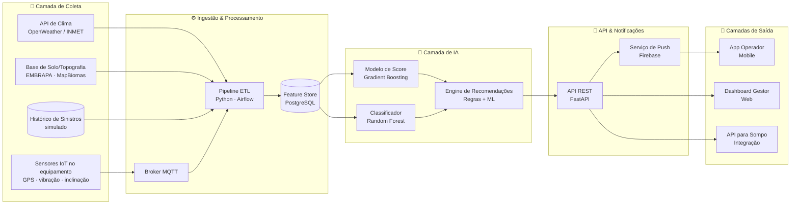

### 7.2 Componentes

| Camada | Tecnologia proposta | Responsabilidade |
|---|---|---|
| Coleta IoT | ESP32 / dispositivo embarcado + MQTT | Captura GPS, inclinação, vibração |
| Ingestão | Mosquitto (broker) + Python | Recebe eventos em tempo real |
| ETL | Python + Pandas + Airflow | Limpa, enriquece e normaliza |
| Armazenamento | PostgreSQL + PostGIS | Dados estruturados + geoespaciais |
| Modelos | scikit-learn / XGBoost | Score, classificação, recomendações |
| API | FastAPI | Servir predições e dados |
| Frontend Web | React + Mapbox | Dashboard do gestor |
| Mobile | React Native | App do operador |
| Notificações | Firebase Cloud Messaging | Push para operador |
| Infra | Docker + AWS (EC2, RDS, S3) | Hospedagem |

### 7.3 Fluxo simplificado de uma decisão

1. Sensor envia coordenada e telemetria a cada 10s.
2. Pipeline enriquece com clima atual + previsão + dados de solo da coordenada.
3. Modelo calcula score e classe de risco.
4. Engine de recomendação cruza score + regras de negócio.
5. Se risco ≥ limiar, dispara push para operador e atualiza dashboard do gestor.
6. Evento (com ou sem sinistro confirmado) volta ao histórico para retreino periódico.

---

## 8. Modelo Preditivo

### 8.1 Abordagem combinada

Optamos por uma arquitetura de **modelo combinado**, pois cada saída tem natureza diferente:

| Saída | Tipo de problema | Algoritmo proposto | Métrica principal |
|---|---|---|---|
| **Score de risco (0–100)** | Regressão / probabilidade | Gradient Boosting (XGBoost) | RMSE + AUC |
| **Classificação** (Baixo/Médio/Alto/Crítico) | Classificação multiclasse | Random Forest | F1-score macro |
| **Recomendação de ação** | Regras + ranking | Regras de negócio + ML auxiliar | Aceitação do operador (feedback) |
| **Alerta** | Trigger | Limiar sobre o score | Precision@K |

### 8.2 Variáveis de entrada (features) — versão Sprint 1

```text
Ambientais:    precip_24h, precip_prev_6h, umidade_solo,
               vento_max, dist_corpo_dagua, declividade
Operacionais:  velocidade, inclinacao, vibracao, jornada_h
Equipamento:   tipo_equip, idade_anos, dias_desde_manut
Contexto:      tipo_operacao, turno, experiencia_operador
```

### 8.3 Saída esperada

```json
{
  "equipamento_id": "EQ-014",
  "timestamp": "2026-03-12T14:30:00Z",
  "risco_score": 94,
  "classe": "Critico",
  "fatores_principais": [
    "precipitacao_24h_acima_50mm",
    "proximidade_corpo_dagua",
    "declividade_alta"
  ],
  "recomendacoes": [
    {"acao": "ADIAR_OPERACAO", "prazo_h": 8, "prioridade": "alta"},
    {"acao": "ROTA_ALTERNATIVA", "rota_id": "R-228", "prioridade": "media"}
  ],
  "alerta_disparado": true
}
```

### 8.4 Justificativa da escolha

- **Gradient Boosting/Random Forest** funcionam bem com features tabulares mistas (numéricas + categóricas) e são interpretáveis via *feature importance* e SHAP — importante para explicar decisões à seguradora.
- **Modelos combinados** atendem aos diferentes consumidores: o operador quer simplicidade (`Crítico` + ação), o gestor quer granularidade (score), a Sompo quer auditabilidade (fatores principais).
- **Regras de negócio** garantem que recomendações respeitem restrições reais (não sugerir rota inviável, etc.).

> ⚠️ Esta foi a proposta inicial (Sprint 1). ✅ **Na Sprint 2 ela foi implementada e ajustada após a EDA:** o classificador final usa **GradientBoosting** (escolhido vs. RandomForest por maior F1-macro) e o score usa **GradientBoostingRegressor** (R²=0,94). Resultados completos em [reports/validation_report.md](reports/validation_report.md).

---

## 9. Interface e Aplicação

### 9.1 App do Operador (mobile)

Tela principal com:
- Card grande de **status atual** (cor por classe: verde/amarelo/laranja/vermelho)
- **Recomendação principal** em linguagem simples
- Botão de **registrar ocorrência**
- Mapa com áreas de risco próximas

### 9.2 Dashboard do Gestor (web)

- Mapa com todos os equipamentos coloridos por risco
- Tabela ranking de risco
- Gráficos: evolução do score por fazenda, top 5 equipamentos críticos, sinistros evitados (estimativa)
- Filtros: por fazenda, equipamento, período

### 9.3 API para Sompo

- Endpoint REST autenticado por API key
- `GET /equipamentos/{id}/historico-risco`
- `GET /sinistros/{id}/contexto-ambiental`
- Retornos em JSON com schema versionado

---

## 10. Segurança, Privacidade e LGPD

| Princípio | Aplicação prática |
|---|---|
| **Controle de acesso** | RBAC (Role-Based Access Control) — operador, gestor, seguradora veem visões diferentes |
| **Autenticação** | JWT + OAuth2; MFA para gestores e Sompo |
| **Criptografia** | TLS 1.3 em trânsito, AES-256 em repouso |
| **Anonimização** | Dados de operadores pseudonimizados em datasets de treino |
| **LGPD** | Consentimento explícito, finalidade declarada, base legal de execução de contrato |
| **Auditoria** | Log de acessos e predições por 12 meses; trilha imutável para análise de sinistros |
| **Integridade IoT** | Assinatura HMAC nas mensagens MQTT para prevenir spoofing |
| **Resiliência** | Backups diários, replicação multi-AZ, plano de DR |

---

## 🚀 Sprint 2 — Implementação da Inteligência de Dados

> **Challenge Sompo Seguros × FIAP — entrega da Sprint 2 de 4.**
> Nesta sprint, saímos do papel: o pipeline de dados, o banco PostgreSQL, os modelos de Machine Learning e o dashboard estão **implementados e rodando localmente**. Todos os números abaixo são **reais**, extraídos de `reports/metrics.json` (modelo `v0.2`, `seed=42`, 100% reprodutível).

### 🔁 Evolução desde a Sprint 1

Na Sprint 1 entregamos a **proposta e a arquitetura**. Na Sprint 2 essa proposta virou **código executável de ponta a ponta**:

| Item | Sprint 1 (proposta) | Sprint 2 (implementado) |
|---|---|---|
| **Dataset** | Snapshot de 8 linhas de exemplo | `data/synthetic_dataset.csv` com **10.000 linhas × 26 colunas**, gerado por `data/generate_dataset.py --seed 42` |
| **Banco de dados** | "PostgreSQL previsto" | **PostgreSQL 16** em `docker-compose` (serviço `db`), com 4 tabelas + 1 view (`vw_risco_completo`) |
| **Modelo de score** | Algoritmo proposto | **GradientBoostingRegressor** treinado: **R² = 0,9361** |
| **Classificação de risco** | Conceito (Baixo/Médio/Alto/Crítico) | **GradientBoosting** treinado: **accuracy = 0,8547 / F1-macro = 0,6632** |
| **Alertas (US01)** | Ideia de "push ao operador" | Regra de alerta sobre o score persistido (limiar = **80**) → **26 alertas** gerados |
| **Mapa / ranking (US04)** | Mockup descrito | Dashboard **Streamlit** com mapa, ranking e evolução por equipamento |
| **Score histórico (US07)** | Endpoint proposto | Scores **persistidos no banco** e consultáveis (queries `Q1..Q6`) |

> 🎯 **User Stories no foco da Sprint 2:** `US01` (operador recebe alertas), `US04` (gestor vê mapa/ranking de risco) e `US07` (Sompo consulta score histórico).

### ▶️ Como executar

**Pré-requisitos:** Docker (Desktop) em execução e Python 3.11.

```bash
# 1) Ambiente virtual + dependências
python3.11 -m venv .venv
source .venv/bin/activate          # Windows: .venv\Scripts\activate
pip install -r requirements.txt

# 2) Variáveis de ambiente
cp .env.example .env

# 3) Sobe o PostgreSQL 16 (serviço "db") em background
docker compose up -d db

# 4) Executa o pipeline completo (gera dados → carrega no banco → EDA → treina → prediz → queries)
./run_pipeline.sh

# 5) Abre o dashboard
streamlit run app/streamlit_app.py
```

> ⚠️ **Porta 5432 ocupada?** Se você já tem um PostgreSQL local usando a porta `5432`, ajuste `POSTGRES_PORT` no arquivo `.env` (ex.: `POSTGRES_PORT=5433`) antes de subir o container.

Caso prefira rodar **passo a passo** (em vez de `./run_pipeline.sh`):

```bash
python data/generate_dataset.py    # gera o dataset sintético (seed=42)
python ml/load_to_db.py            # carrega CSV → PostgreSQL
python ml/eda.py                   # análise exploratória + figuras
python ml/train.py                 # treina os 3 modelos
python ml/predict.py               # gera e persiste scores no banco
python ml/run_queries.py           # roda as queries de validação (Q1..Q6)
```

### 🧩 Módulos integrados

O fluxo segue a cadeia **coleta/CSV → banco SQL → ML → scores → dashboard**:

```text
data/synthetic_dataset.csv  →  PostgreSQL (db)  →  modelos ML  →  scores_risco  →  Streamlit
       (geração)               (load_to_db)        (train)         (predict)        (dashboard)
```

| Arquivo | Função |
|---|---|
| `data/generate_dataset.py` | Gera o dataset sintético (10.000 linhas, `seed=42`) |
| `ml/db.py` | Conexão com o PostgreSQL e helpers de I/O |
| `ml/load_to_db.py` | Carrega o CSV para as tabelas do banco |
| `ml/features.py` | Contrato de *features* — define as 13 numéricas + 3 categóricas e a decisão anti-vazamento (fonte única da verdade entre treino e inferência) |
| `ml/eda.py` | Análise exploratória + geração das figuras |
| `ml/train.py` | Pré-processamento (`ColumnTransformer`: OneHot nas categóricas, numéricas em passthrough) + split estratificado 70/15/15; treina classificador de classe, regressor de score e classificador de sinistro |
| `ml/predict.py` | Gera predições e persiste os scores no banco |
| `ml/run_queries.py` | Executa as queries de validação `Q1..Q6` |
| `app/streamlit_app.py` | Dashboard (mapa, ranking, evolução, alertas) |
| `sql/schema.sql` | DDL das tabelas e da view `vw_risco_completo` |
| `sql/queries.sql` | Queries `Q1..Q6` comentadas |
| `run_pipeline.sh` | Orquestra todo o pipeline em um comando |

> 🛡️ **Anti-vazamento de dados (data leakage):** os alvos e derivados (`risco_score`, `classe_risco`, `sinistro`, `tipo_sinistro`, `severidade_sinistro`) **não entram** em `X`. `latitude`/`longitude` também ficam **fora do modelo** — são mantidas apenas para o mapa. Modelagem com scikit-learn (**sem** XGBoost).

### 📊 Resultados do modelo

Três modelos foram treinados (`seed=42`). Métricas no **conjunto de teste** (1.500 linhas):

| Modelo | Algoritmo | Métricas (teste) |
|---|---|---|
| **Classificador de classe** (principal) | GradientBoosting | **accuracy = 0,8547** · **F1-macro = 0,6632** · CV(5-fold) F1-macro = 0,5813 ± 0,0081 |
| **Regressor de score (0–100)** | GradientBoostingRegressor | **RMSE = 3,39** · **MAE = 2,66** · **R² = 0,9361** |
| **Classificador de sinistro (0/1)** (complementar) | RandomForest *balanced* | **AUC = 0,7489** · F1 = 0,3099 · recall = 0,2308 |

**Seleção do classificador principal** — comparação na validação:

| Modelo | F1-macro (val) | Accuracy (val) | Escolhido |
|---|---|---|---|
| RandomForest | 0,6258 | 0,8687 | — |
| **GradientBoosting** | **0,6765** | **0,8707** | ✅ |

**Desempenho por classe** (classificador, teste):

| Classe | Precision | Recall | F1 | Suporte |
|---|---|---|---|---|
| Baixo | 0,88 | 0,91 | 0,90 | 828 |
| Medio | 0,83 | 0,80 | 0,82 | 586 |
| Alto | 0,73 | 0,75 | 0,74 | 80 |
| Critico | 0,25 | 0,17 | 0,20 | 6 |

> 📄 Relatório completo de métricas e validação em [`reports/validation_report.md`](reports/validation_report.md).

### ✅ Validação de negócio

A **query Q3** cruza a **classe prevista** pelo modelo com a **taxa de sinistro REAL** observada. A taxa cresce de forma **monotônica** conforme a classe de risco sobe — evidência de que o modelo realmente **separa risco**:

| Classe prevista | Leituras | Score médio | Taxa de sinistro real |
|---|---|---|---|
| Baixo | 5.729 | 24,4 | 4,82% |
| Medio | 3.722 | 39,8 | 14,59% |
| Alto | 510 | 67,2 | 41,96% |
| Critico | 39 | 80,0 | 61,54% |

> 📈 **Análise de variável crítica (Q4)** — risco por faixa de distância a corpo d'água: `0–50 m` → score 35,5 / sinistro 12,20% · `50–200 m` → 34,7 / 11,61% · `200–500 m` → 32,6 / 10,78% · `>500 m` → 28,3 / 8,27%. Quanto mais perto da água, maior o risco.
>
> 🚨 **Alertas (US01):** sobre os scores persistidos (distribuição prevista: Baixo=5.729, Medio=3.722, Alto=510, Critico=39), o limiar de alerta = **80** disparou **26 alertas**.

### 🖼️ Prints e dashboard

Dashboard Streamlit completo (mapa, ranking de risco e KPIs de prevenção):

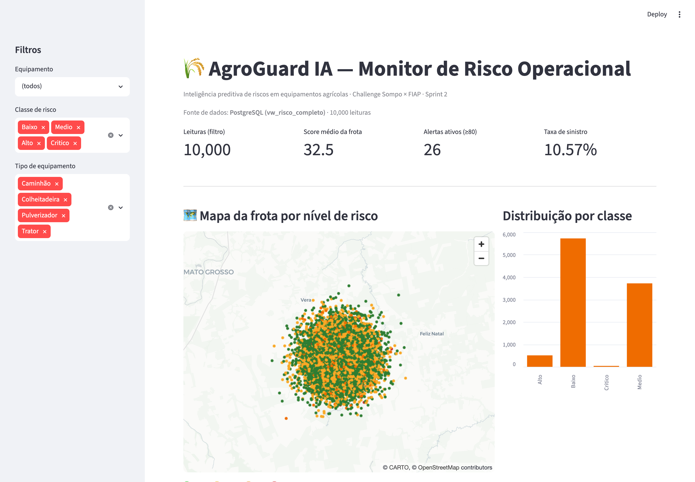

Evolução do score histórico do equipamento `EQ-014` (atende `US07` — score histórico para a Sompo):

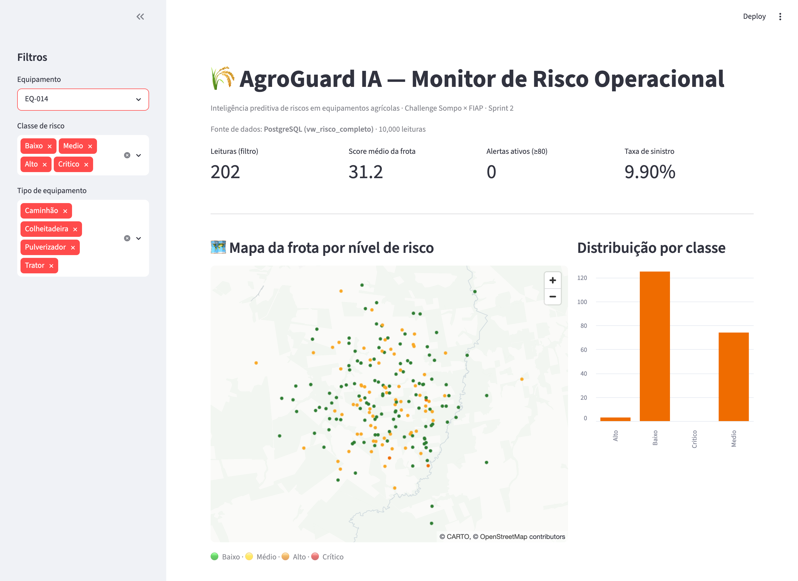

Figuras geradas pelo pipeline (em `reports/figures/`): a **matriz de confusão** (`reports/figures/confusion_matrix.png`) e o **heatmap de correlações** (`reports/figures/correlation_heatmap.png`) — além de `feature_importance.png`, `regression_pred_vs_real.png`, `roc_sinistro.png` e `score_distribution.png`.

### 📁 Estrutura do repositório (Sprint 2)

```text
.
├── README.md
├── docker-compose.yml              ← PostgreSQL 16 (serviço "db")
├── run_pipeline.sh                 ← orquestra o pipeline completo
├── requirements.txt
├── .env.example
├── data/
│   ├── generate_dataset.py         ← gerador sintético (seed=42)
│   └── synthetic_dataset.csv       ← 10.000 linhas × 26 colunas
├── ml/
│   ├── db.py                       ← conexão PostgreSQL
│   ├── features.py                 ← ColumnTransformer + split estratificado
│   ├── train.py                    ← treino dos 3 modelos
│   ├── load_to_db.py               ← CSV → banco
│   ├── predict.py                  ← scores → banco
│   ├── run_queries.py              ← validação Q1..Q6
│   ├── eda.py                      ← análise exploratória
│   └── models/                     ← *.joblib (gitignored)
├── sql/
│   ├── schema.sql                  ← DDL + view vw_risco_completo
│   └── queries.sql                 ← Q1..Q6 comentadas
├── app/
│   └── streamlit_app.py            ← dashboard
├── reports/
│   ├── metrics.json                ← métricas reais (v0.2)
│   ├── validation_report.md
│   └── figures/                    ← confusion_matrix, correlation_heatmap, ...
└── docs/
    ├── personas.md
    ├── data-dictionary.md
    ├── architecture.md
    ├── model-card.md
    ├── predictive-intelligence.md
    └── prints/                     ← dashboard_full.png, dashboard_evolucao_eq014.png, ...
```

### 🔗 Documentação da Sprint 2

- 🧠 [`docs/predictive-intelligence.md`](docs/predictive-intelligence.md) — detalhes da inteligência preditiva
- 🏗️ [`docs/architecture.md`](docs/architecture.md) — arquitetura aprofundada
- 📄 [`reports/validation_report.md`](reports/validation_report.md) — relatório de validação e métricas

### ⚖️ Limitações honestas

- A classe **`Critico` é rara** (43 em 10.000 → apenas **6** no conjunto de teste), o que leva a **recall baixo (0,17)**. **Mitigação:** o **alerta é baseado no SCORE** (regressor com R² = 0,9361 / RMSE = 3,39), e **não** na classe rara; somado a *threshold tuning* e à coleta de **mais dados reais na Sprint 4**.
- No gerador sintético, `risco_score` e `classe_risco` são **função determinística** — os modelos aprendem essa função latente a partir das *features* brutas (válido academicamente, documentado como limitação). Já o alvo **`sinistro` é estocástico** (AUC = 0,7489), representando um problema de ML mais "real".
- **Dados 100% sintéticos**; validação cruzada com **dados reais está prevista para a Sprint 4**.

### 📌 Pendências de entrega (equipe) — Sprint 2 (histórico)

- [ ] **Convidar os tutores como colaboradores** do repositório: `nicollycrs` e `SabrinaOtoni`. ⚠️ Apenas o **dono do repositório** (`willbatista89`, admin) consegue enviar o convite — o Kaique é colaborador, não admin.
- [ ] **Gravar o vídeo** (≤ 5 min, "não listado") e colar o link no README (placeholder abaixo).
- [ ] **Preencher os nomes/RMs reais** da equipe na seção [Equipe e Divisão de Tarefas](#12-equipe-e-divisão-de-tarefas).

---

## 🏁 Sprint 4 — Consolidação e validação do MVP

> **Challenge Sompo Seguros × FIAP — entrega 4 de 4.** As Sprints 3 e 4 foram desenvolvidas em conjunto e entregues em **22/09/2026** neste repositório (branch `sprint-3-4`, tags `sprint-3` e `sprint-4`). A Sprint 3 integrou os módulos; a Sprint 4 refinou, validou e documentou o MVP. Todos os números desta seção vêm de execuções reais registradas em `reports/`, `docs/prints/` e `docs/validacao.md`.

### 🎯 O que a Sprint 4 pedia × o que foi entregue

| Requisito FIAP | Entrega | Onde ver |
|---|---|---|
| **Refinamento do código e da arquitetura** — módulos, funções padronizadas, exceções | Backend organizado por contexto de negócio (`agroguard/telemetria`, `risco`, `alertas`, `relatorios`, `auditoria`), roteadores finos, hierarquia `ErroAgroGuard` → HTTP 401/403/409/422/429/503 sem stack trace; `ml/` virou pacote | `agroguard/`, `agroguard/erros.py`, `docs/architecture.md` |
| **Engenharia de dados e modelo** — inconsistências, faltantes, duplicidades; ajuste final com métricas | `ml/preparacao.py` (dedup, imputação por tipo, clip de faixas, relatório `reports/data_quality.json`); **modelo v0.3**: grid na validação + classe derivada do score → **R² 0,943 · RMSE 3,20 · F1-macro 0,817 · recall Crítico 0,67** (v0.2: 0,936 · 3,39 · 0,663 · 0,17) | `reports/metrics.json` (`comparacao_v02_v03`), `docs/model-card.md` §11 |
| **Validação da integração** — coleta confiável, sem perda ou corrupção | Simulador com eventos inválidos e duplicados propositais; teste de reconciliação exata (`enviados = aceitos + rejeitados + duplicados`), um score por leitura, score gravado == modelo recalculado, `classe == faixa(score)` | `tests/test_integracao.py`, `docs/validacao.md`, `docs/prints/` |
| **Segurança e rastreabilidade** | Chaves por papel, rate limit, HMAC opcional, hash do payload; `request_id` em `logs_uso` → `leituras_telemetria` → `scores_risco` → `alertas`; `GET /auditoria/{request_id}` encadeia tudo | `docs/seguranca.md`, `agroguard/api/auth.py`, `agroguard/auditoria/` |
| **Relatórios, alertas e visualização** — tendências por equipamento, região, operação | Dashboard com abas *Tendências* (dia/semana × equipamento/região/operação), *Alertas & recomendações* (critérios explícitos), *Equipamento* (histórico + fatores), *Auditoria*; relatório semanal Markdown + figuras (US05) | `app/streamlit_app.py`, `relatorios/gerar_relatorio.py`, `reports/relatorio_risco.md` |
| **Documentação e validação final** | Este README, diagrama final, `docs/validacao.md` com a saída real dos testes, roteiro do vídeo | `docs/architecture.md`, `docs/roteiro-video.md` |

### 🧠 Modelo v0.3 — o que mudou e por quê

| Métrica (teste, 1.500 linhas) | v0.2 (Sprint 2) | **v0.3 (Sprint 4)** | Δ |
|---|---|---|---|
| R² do score | 0,9361 | **0,9430** | +0,007 |
| RMSE do score | 3,39 | **3,20** | −0,19 |
| MAE do score | 2,66 | **2,50** | −0,17 |
| F1-macro da classe | 0,6632 | **0,8171** | +0,154 |
| Recall da classe `Crítico` | 0,1667 | **0,6667** | +0,50 |

- **Ajuste de hiperparâmetros na validação** (nunca no teste): grid de 24 configurações do `GradientBoostingRegressor`; melhor: `n_estimators=400, learning_rate=0.1, max_depth=2, subsample=0.8` (`ml/models/model_meta.json`).
- **Classe derivada do score** pelas faixas de negócio (`≤30 Baixo · ≤60 Médio · ≤80 Alto · >80 Crítico`) em vez de um classificador separado: elimina a incoerência score × classe e resolve a classe rara (`Crítico` tem 43 linhas em 10.000). O classificador direto continua salvo como baseline (`comparacao_classe` em `metrics.json`).
- **Validação cruzada corrigida**: na Sprint 2 a CV rodava só no conjunto de teste; agora roda em treino+validação (5 folds): RMSE 3,24 ± 0,04 e F1-macro 0,82 ± 0,04.
- **Limiar de alerta mantido em 80** após análise dos limiares 70/75/80/85 (`alerta_analise` em `metrics.json`): taxa de sinistro real de 66,7 % acima do limiar contra 9,3 % abaixo.
- **Explicabilidade**: cada score traz os 3 fatores que mais pesaram (`fatores_principais`), calculados por contrafactual (feature na mediana de treino → diferença em pontos). Ex.: `[{"fator":"precip_24h_mm","valor":69.9,"contribuicao_pts":32.6}, …]`.
- **Limitações honestas**: apenas 6 linhas `Crítico` no teste (recall instável — por isso a CV e a métrica `Alto ∪ Crítico` também são reportadas); dados 100 % sintéticos.

### ✅ Evidências de validação

**Suíte de testes** — `AGROGUARD_REQUIRE_DB=1 pytest -q -rA` (saída completa em [`docs/prints/pytest_output.txt`](docs/prints/pytest_output.txt), execução de 22/09/2026):

```text
68 passed, 1 warning in 12.35s
```

| Arquivo | Testes | O que prova |
|---|---|---|
| `tests/test_preparacao.py` | 9 | duplicidades, faltantes, fora de faixa, categorias inválidas, dataset vazio |
| `tests/test_inferencia.py` | 13 | faixas de classe, `alerta == score ≥ 80`, fatores principais, determinismo |
| `tests/test_auth.py` | 9 | sem chave 401, chave errada 401, operador em auditoria 403, rate limit 429 (por chave e por IP), assinatura inválida 401, validação das chaves configuradas |
| `tests/test_api.py` | 18 | POST válido (201 + leitura + score + log com o mesmo `request_id`), fora de faixa 422, duplicado 409, inconsistência 422, equipamento desconhecido 422, lote com validação por item, alerta com recomendações, histórico (mais recentes), tendências por grupo, rastreabilidade, erro interno com `request_id` e log, corpo grande 413 |
| `tests/test_integracao.py` | 5 | **coleta sem perda** (200 eventos → 180 aceitos + 10 rejeitados + 10 duplicados, 200 linhas em `logs_uso`), **consistência** score gravado == modelo recalculado e `classe == faixa(score)`, lote, assinatura adulterada, rastreabilidade |
| `tests/test_relatorio.py` | 14 | relatório semanal + figuras, normalização de JSONB, dashboard compila |

Os testes de integração rodam contra o banco **local** `agroguard_test` (criado e recriado pela própria suíte), nunca contra dados reais. Um *revert check* foi feito na regra de duplicidade: desativando-a, o teste de duplicado falha (a `UNIQUE (equip_id, data_hora)` do banco vira a segunda linha de defesa e devolve 500 em vez de 409) — ou seja, o teste é sensível ao comportamento.

**Fontes simuladas → API viva** — `python -m simulador.simulador_iot --n 100 --seed 42 --taxa-invalidos 0.05 --taxa-duplicados 0.05 --assinar` (saída em [`docs/prints/simulador_execucao.txt`](docs/prints/simulador_execucao.txt)):

```text
[0000] tipo=valido    equip=EQ-001 status=201 score=19 classe=Baixo
[0001] tipo=valido    equip=EQ-002 status=201 score=26 classe=Baixo
...
[0098] tipo=duplicado equip=EQ-004 status=409 erro=duplicado
[0099] tipo=duplicado equip=EQ-005 status=409 erro=duplicado
enviados=100 aceitos=90 rejeitados=5 duplicados=5 alertas=0 (A+R+D=100 ✔)
```

Contagens no banco após a execução (`docs/validacao.md`): `leituras_telemetria` (origem simulador) = 90 · `scores_risco` = 90 · `logs_uso` = 100 (uma por requisição, inclusive as recusadas) · `leituras_rejeitadas` = 10 (2 validação, 2 inconsistência, 1 equipamento desconhecido, 5 duplicados). Nenhum evento se perdeu e nenhum entrou duas vezes. Detalhes, comandos de reprodução e limitações em [`docs/validacao.md`](docs/validacao.md).

### 🖼️ Interface final

Capturas reais do dashboard (validação em navegador em 22/09/2026 — 7 cenários, 0 erros de console, nenhuma requisição 4xx/5xx; execução registrada na seção Evidências):

| Alertas & recomendações — critério explícito `risco_score >= 80`, recomendações com o critério que disparou | Tendências semanais por região (chave, período, leituras, score médio/pico, alertas, taxa de sinistro) + insight automático |
|---|---|
| 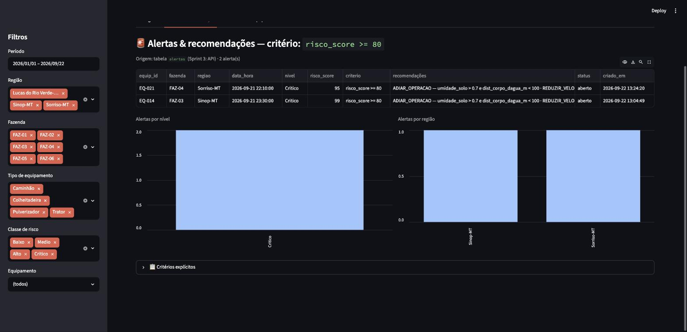 | 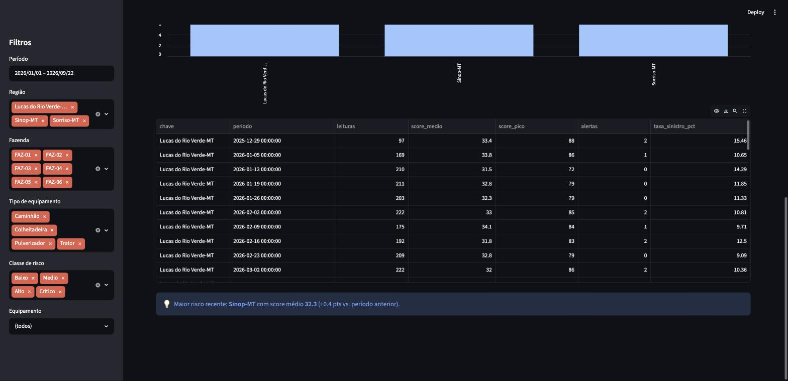 |

| Equipamento EQ-014 — evolução do score (US07) e fatores que pesaram em cada leitura | Auditoria — requisições registradas por status HTTP e leituras rejeitadas por motivo |
|---|---|
| 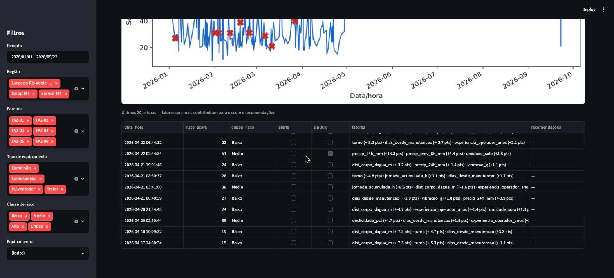 | 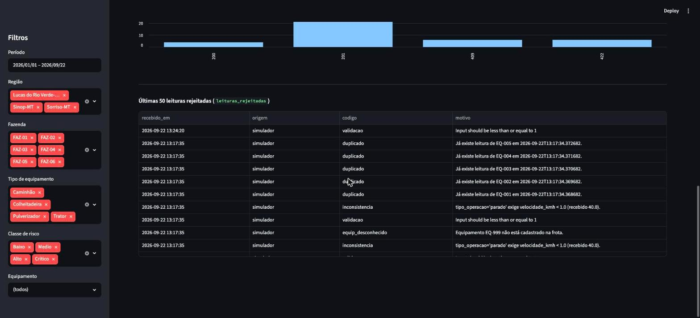 |

Relatório semanal gerado por `python -m relatorios.gerar_relatorio` → [`reports/relatorio_risco.md`](reports/relatorio_risco.md) (top-5 equipamentos, tendência por região e por tipo de operação, alertas abertos e recomendações da semana) com as figuras `reports/figures/tendencia_*.png`.

---

## 🔗 Sprint 3 — Integração dos módulos

> **Objetivo da Sprint 3:** transformar os componentes da Sprint 2 (dataset, banco, modelo, dashboard) em um **sistema único**: os dados entram, são armazenados e processados, o modelo gera o score e o sistema apresenta o resultado — com segurança e registros de uso.

### 🔁 Evolução desde a Sprint 2

| Item | Sprint 2 | Sprint 3 |
|---|---|---|
| **Entrada de dados** | CSV carregado em lote (`ml/load_to_db.py`) | **API `POST /telemetria`** (FastAPI) recebendo telemetria + ambiente + operação, e **simulador de fontes** (`simulador/`) que envia leituras contínuas |
| **Backend** | scripts independentes | **`agroguard/`** orquestra entrada → banco → modelo → saída numa única transação por leitura |
| **Modelo** | `predict.py` em lote | **`ml/inferencia.py`** — contrato único usado pela API e pelo lote; score + classe + alerta na hora (latência registrada) |
| **Banco** | 4 tabelas | **schema v2**: `alertas`, `leituras_rejeitadas`, `logs_uso`, `fazenda`/`regiao`, hash e origem das leituras, `UNIQUE(equip_id, data_hora)` |
| **Segurança** | nenhuma | **X-API-Key por papel** (dispositivo/operador/gestor/seguradora/admin), comparação em tempo constante, rate limit, assinatura HMAC opcional, segredos fora do git |
| **Registros de uso** | nenhum | `logs_uso` (uma linha por requisição, inclusive erros) + `logs/agroguard.log` (JSON) + `request_id` em todas as tabelas |
| **Interface** | dashboard Streamlit (mapa, ranking) | dashboard lendo as novas tabelas: **alertas com recomendações**, auditoria; Swagger em `/docs` para a Sompo |

### 🔌 API integradora

| Rota | Papéis | Função |
|---|---|---|
| `POST /telemetria` · `POST /telemetria/lote` | dispositivo, operador, admin | Recebe a leitura (validação de faixas + consistência + dedup), grava, pontua, alerta |
| `GET /equipamentos` · `GET /equipamentos/{id}/scores` | gestor, seguradora, admin | Frota e histórico de score por equipamento (US07) |
| `GET /alertas` · `POST /alertas/{id}/reconhecer` | gestor, seguradora, admin (reconhecer: gestor, admin) | Alertas com critério e recomendações (US01/US04) |
| `GET /relatorios/tendencias?por=equipamento\|regiao\|operacao&janela=dia\|semana` | gestor, seguradora, admin | Tendências de risco |
| `GET /auditoria/logs` · `/auditoria/rejeitadas` · `/auditoria/{request_id}` | admin | Registros de uso e rastreabilidade ponta a ponta |
| `GET /health` · `GET /modelo/info` | público / admin, gestor, seguradora | Saúde e versão do modelo |

Exemplo completo de requisição/resposta em [`docs/api.md`](docs/api.md). Resposta de uma leitura crítica:

```json
{"leitura_id": 10001, "equip_id": "EQ-014", "data_hora": "2026-09-21T23:30:00",
 "risco_score": 99, "classe_risco": "Critico", "alerta": true, "nivel_alerta": "Critico",
 "fatores_principais": [{"fator": "precip_24h_mm", "valor": 120.0, "contribuicao_pts": 28.8},
                        {"fator": "umidade_solo", "valor": 0.95, "contribuicao_pts": 10.1},
                        {"fator": "precip_prev_6h_mm", "valor": 15.0, "contribuicao_pts": 8.8}],
 "recomendacoes": [{"acao": "ADIAR_OPERACAO", "criterio": "umidade_solo > 0.7 e dist_corpo_dagua_m < 100", "prioridade": "alta"},
                   {"acao": "REDUZIR_VELOCIDADE", "criterio": "declividade_pct > 5 ou inclinacao_graus > 6", "prioridade": "alta"},
                   {"acao": "ATENCAO_CHUVA", "criterio": "precip_24h_mm > 30 ou precip_prev_6h_mm > 10", "prioridade": "media"},
                   {"acao": "INSPECAO_MECANICA", "criterio": "dias_desde_manutencao > 40 ou vibracao_g > 1.5", "prioridade": "media"},
                   {"acao": "PAUSA_JORNADA", "criterio": "jornada_acumulada_h > 10", "prioridade": "media"}],
 "regras_aplicadas": ["risco_score >= 80"], "modelo_versao": "v0.3",
 "request_id": "6708a631-9642-4303-9e59-057ad8c44ba3", "latencia_ms": 107}
```

Reenviar a **mesma** leitura devolve `409 {"codigo": "duplicado"}`; `GET /auditoria/6708a631-…` (admin) devolve `log` (201) → `leitura` (id 10001) → `score` (99) → `alerta` (Crítico) — execução real registrada em 22/09/2026.

### 🛡️ Segurança da informação — evidências

| Controle | Implementação | Prova |
|---|---|---|
| Controle de acesso | `X-API-Key` → papel; permissões por rota | `tests/test_auth.py`: sem chave → 401, chave errada → 401, operador em `/auditoria` → 403 |
| Proteção da API | rate limit por chave (429), erros sem stack trace, CORS fechado | `tests/test_auth.py::test_rate_limit*` |
| Integridade | `payload_hash` SHA-256, `UNIQUE(equip_id, data_hora)` → 409, assinatura HMAC (`X-Signature`) | `tests/test_api.py` (duplicado), `tests/test_integracao.py` (assinatura adulterada → 401) |
| Dados sensíveis | segredos só no `.env` (gitignored); logs gravam apenas o `kid`, nunca a chave | `agroguard/logs.py`, `.env.example` |
| Registros de uso | `logs_uso` por requisição + `request_id` encadeado | `GET /auditoria/{request_id}` |

Detalhes e o que fica para produção (JWT/MFA, TLS, criptografia em repouso) em [`docs/seguranca.md`](docs/seguranca.md).

### 🗺️ Diagrama de arquitetura (entrada → banco → modelo → saída)

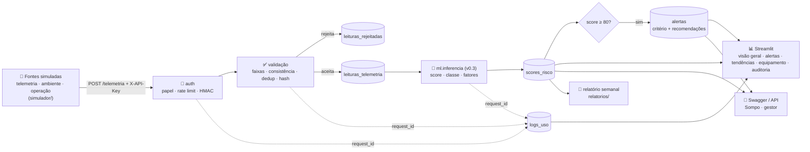

Diagrama detalhado, fluxo passo a passo e ADRs em [`docs/architecture.md`](docs/architecture.md).

### 🖼️ Interface simples (Sprint 3) — dashboard e API

| Visão geral — KPIs, mapa da frota por classe e ranking de risco (US04) | Swagger `/docs` — 12 rotas da API integradora |
|---|---|
| 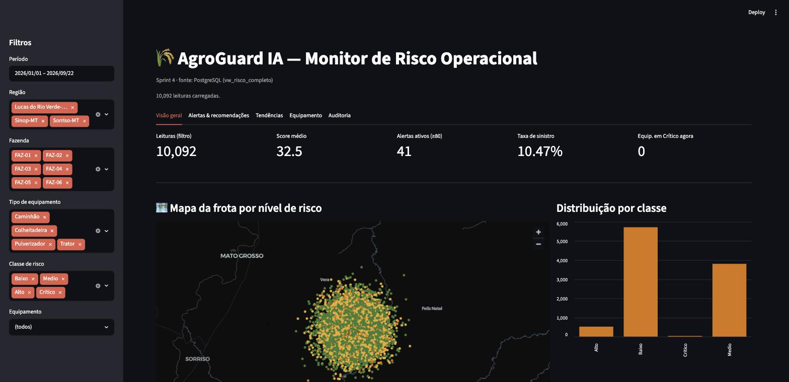 | 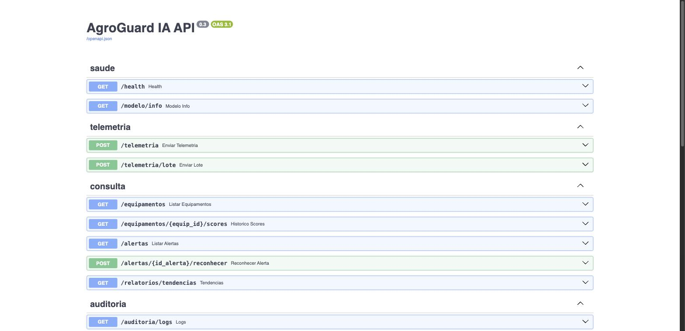 |

`POST /telemetria` de uma leitura crítica pelo Swagger/curl → `201`, score 95, classe Crítico, alerta e recomendações (print: `docs/prints/swagger_telemetria_201.png`).

---

## 📈 Evolução do projeto nas 4 Sprints

| Sprint | Foco (FIAP) | Entregue | Status |
|---|---|---|---|
| **1** | Entendimento do problema, proposta e arquitetura | Personas, user stories, dataset exemplo, diagrama, modelo proposto | ✅ |
| **2** | Inteligência de dados | Dataset sintético (10.000 × 26), PostgreSQL, EDA, modelos v0.2, queries Q1..Q6, dashboard básico | ✅ |
| **3** | Integração dos módulos (MVP ~60 %) | Backend FastAPI, schema v2, simulador de fontes, controle de acesso, registros de uso, dashboard com alertas, diagrama atualizado | ✅ (entregue com a Sprint 4) |
| **4** | Consolidação e validação | Código modular + exceções, preparação de dados, modelo v0.3 (métricas justificadas), testes de integração/consistência, tendências e relatórios, README final | ✅ |

---

## 11. Planejamento das Próximas Sprints

| Sprint | Foco | Principais entregas |
|---|---|---|
| **Sprint 1 ✅** | Proposta e arquitetura | README, personas, dataset exemplo, diagrama, modelo proposto |
| **Sprint 2 ✅** | Dados e modelo base | Dataset simulado gerado, EDA, banco SQL (PostgreSQL), modelos treinados (R²=0,94 / acc=0,85), validação estatística, dashboard Streamlit — ver [🚀 Sprint 2](#-sprint-2--implementação-da-inteligência-de-dados) |
| **Sprint 3 ✅** | Integração | Backend FastAPI + schema v2 + simulador + segurança + registros de uso — ver [🔗 Sprint 3](#-sprint-3--integração-dos-módulos) |
| **Sprint 4 ✅** | Consolidação e validação | Modelo v0.3, preparação de dados, testes de integração, tendências/relatórios, README final, vídeo — ver [🏁 Sprint 4](#-sprint-4--consolidação-e-validação-do-mvp) |

### 11.1 Roadmap visual

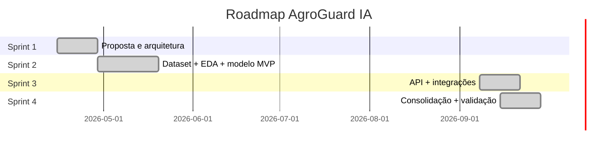

---

## 12. Equipe e Divisão de Tarefas

| Integrante | RM | Função principal | Responsabilidades Sprint 1 |
|---|---|---|---|
| [Nome 1] | RMxxxxxx | Product Owner / Negócio | Personas, user stories, contexto |
| [Nome 2] | RMxxxxxx | Data Scientist | Modelo preditivo, dataset simulado |
| [Nome 3] | RMxxxxxx | Arquiteto / Backend | Arquitetura, fluxo de dados |
| [Nome 4] | RMxxxxxx | Front-end / UX | Mockups, definição de telas |
| [Nome 5] | RMxxxxxx | DevOps / Segurança | Infra proposta, segurança/LGPD |

> 🗂️ A gestão de tarefas é feita no **Trello**: [link do board]

---

## 13. Vídeo de Apresentação

🎥 **Sprint 4 — link do vídeo (até 5 minutos, não listado):** [inserir link do vídeo não-listado]

Roteiro minuto a minuto em [`docs/roteiro-video.md`](docs/roteiro-video.md): contexto → arquitetura → simulador enviando dados → Swagger (score, alerta, rastreabilidade, segurança) → dashboard (alertas, tendências, equipamento, auditoria) → métricas v0.3 e testes.

### ✅ Checklist de entrega (equipe)

- [ ] Gravar o vídeo (≤ 5 min, narração humana, YouTube "não listado") e colar o link acima.
- [ ] Confirmar que o repositório é **privado** e que o perfil **`fiap-tutoria`** foi convidado como colaborador (apenas o dono `willbatista89` consegue enviar o convite; o convite expira em 7 dias).
- [ ] Preencher a divisão de tarefas das Sprints 3/4 na seção 12.
- [ ] Não alterar o repositório após a data-limite (28/09/2026).

---

## 14. Como Navegar pelo Repositório

```text
.
├── README.md                     ← este arquivo
├── docker-compose.yml            ← PostgreSQL 16 + pgAdmin (Sprint 2)
├── .env.example                  ← variáveis de ambiente do banco
├── requirements.txt              ← dependências Python
├── run_pipeline.sh               ← executa todo o fluxo de ponta a ponta
├── data/
│   ├── generate_dataset.py       ← gerador do dataset simulado (seed=42)
│   └── synthetic_dataset.csv     ← dataset simulado (10.000 linhas × 26 colunas)
├── sql/
│   ├── schema.sql                ← DDL (equipamentos, leituras_telemetria, scores_risco, sinistros)
│   └── queries.sql               ← consultas analíticas de risco (Q1..Q6)
├── ml/
│   ├── features.py               ← contrato de features (anti-vazamento)
│   ├── db.py                     ← conexão SQLAlchemy
│   ├── load_to_db.py             ← ingestão CSV → PostgreSQL
│   ├── eda.py                    ← análise exploratória
│   ├── train.py                  ← treino + validação dos modelos
│   ├── predict.py                ← inferência → grava scores no banco
│   └── run_queries.py            ← executa as queries de risco
├── app/
│   └── streamlit_app.py          ← dashboard de monitoramento (front-end básico)
├── reports/
│   ├── validation_report.md      ← relatório de validação estatística
│   ├── metrics.json              ← métricas dos modelos
│   └── figures/                  ← matriz de confusão, ROC, correlações, etc.
├── docs/
│   ├── personas.md               ← detalhamento das personas
│   ├── architecture.md           ← arquitetura (atualizada — pipeline Sprint 2)
│   ├── data-dictionary.md        ← dicionário do dataset
│   ├── model-card.md             ← model card (v0.2 — métricas reais)
│   ├── predictive-intelligence.md ← documentação da inteligência preditiva
│   └── prints/                   ← capturas de tela do dashboard + log de execução
└── .gitignore
```

---

## 📚 Referências

- INMET — Instituto Nacional de Meteorologia: https://portal.inmet.gov.br
- EMBRAPA — Mapeamento de solos: https://www.embrapa.br
- MapBiomas — Cobertura e uso da terra: https://mapbiomas.org
- LGPD — Lei nº 13.709/2018
- Sompo Seguros Brasil: https://www.sompo.com.br

---

> Projeto desenvolvido no Challenge Sompo × FIAP — turma [A/B] — 2026.
> Conteúdo acadêmico — entrega final (Sprint 4).
