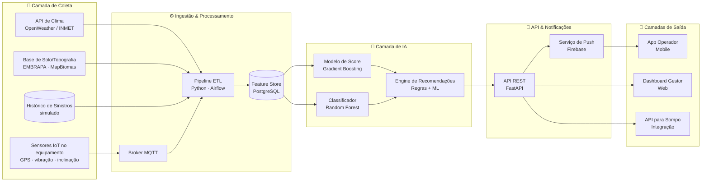
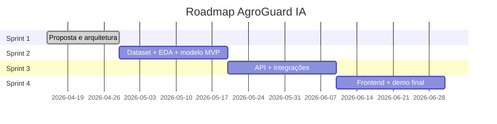

# 🌾 AgroGuard IA — Inteligência Preditiva para Riscos em Equipamentos Agrícolas

> **Challenge Sompo Seguros × FIAP — Sprint 1**
> Solução baseada em dados e Inteligência Artificial para **identificar, prever e reduzir riscos operacionais e ambientais** relacionados ao uso de equipamentos agrícolas.

  

---

## 📋 Sumário

1. [Contexto do Desafio](#1-contexto-do-desafio)
2. [O Problema](#2-o-problema)
3. [A Solução Proposta](#3-a-solução-proposta)
4. [Personas e User Stories](#4-personas-e-user-stories)
5. [Fontes de Dados e Variáveis](#5-fontes-de-dados-e-variáveis)
6. [Dataset Simulado (Exemplo)](#6-dataset-simulado-exemplo)
7. [Arquitetura da Solução](#7-arquitetura-da-solução)
8. [Modelo Preditivo](#8-modelo-preditivo)
9. [Interface e Aplicação](#9-interface-e-aplicação)
10. [Segurança, Privacidade e LGPD](#10-segurança-privacidade-e-lgpd)
11. [Planejamento das Próximas Sprints](#11-planejamento-das-próximas-sprints)
12. [Equipe e Divisão de Tarefas](#12-equipe-e-divisão-de-tarefas)
13. [Vídeo de Apresentação](#13-vídeo-de-apresentação)
14. [Como Navegar pelo Repositório](#14-como-navegar-pelo-repositório)

---

## 1. Contexto do Desafio

A **Sompo Seguros** é uma seguradora global com forte atuação no Brasil em soluções de seguros e gestão de riscos, com investimento crescente em **dados, IA e prevenção**. Neste Challenge, somos provocados a desenvolver uma solução que ajude a antecipar — em vez de apenas remediar — sinistros envolvendo **equipamentos agrícolas** (colheitadeiras, tratores, pulverizadores, caminhões de transporte etc.).

O Brasil é o 4º maior mercado de máquinas agrícolas do mundo. Cada equipamento de grande porte custa **entre R$ 800 mil e R$ 3 milhões**, e um único evento de atolamento, colisão ou tombamento pode gerar prejuízos que vão de horas paradas a perda total. Hoje, grande parte dessas decisões ainda é tomada de forma **reativa**, depois que o incidente já aconteceu.

---

## 2. O Problema

### 2.1 Dor central

> **Baixa previsibilidade de riscos operacionais e ambientais em equipamentos agrícolas, levando a decisões reativas, sinistros frequentes e custos elevados para produtores e seguradora.**

### 2.2 Cenário ilustrativo

> Um operador realiza colheita às margens de um rio após dois dias seguidos de chuva. Sem visibilidade da umidade do solo, da inclinação do terreno ou do histórico de atolamentos da região, ele entra em uma área instável. A colheitadeira atola, exige resgate por trator de grande porte, paralisa a operação por 14h e gera um sinistro de R$ 180 mil — boa parte dele evitável.

### 2.3 Riscos mapeados

| Categoria | Exemplos |
|---|---|
| **Ambientais** | Chuva intensa, solo encharcado, proximidade de cursos d'água, declividade acentuada, geada, vento |
| **Operacionais** | Operador inexperiente, jornada excessiva, manutenção atrasada, sobrecarga, velocidade inadequada |
| **Logísticos** | Transporte rodoviário, rotas com risco, pontes com restrição de peso, condições do asfalto |
| **Mecânicos** | Falhas em pneus, hidráulicos, transmissão; histórico de manutenção do equipamento |

### 2.4 Por que é relevante

- 📉 **Custo:** sinistros agrícolas têm ticket médio elevado e impactam diretamente o sinistralidade da carteira da seguradora.
- ⏱️ **Perda operacional:** janelas de plantio e colheita são curtas — uma máquina parada na safra custa muito mais que o conserto.
- 🌱 **Sustentabilidade:** vazamentos de óleo, tombamentos próximos a corpos d'água e danos ambientais geram passivos ESG.
- 🤝 **Relação seguradora–segurado:** prevenção fortalece a relação e reduz fraudes/disputas.

---

## 3. A Solução Proposta

### 3.1 Visão geral

O **AgroGuard IA** é uma plataforma de **prevenção inteligente de riscos para equipamentos agrícolas**, que combina dados climáticos, telemetria de sensores IoT embarcados, características do solo e histórico de sinistros para gerar, em tempo quase real:

1. **Score de risco (0–100)** — quanto maior, mais alta a probabilidade de incidente nas próximas horas.
2. **Classificação categórica** — `Baixo` / `Médio` / `Alto` / `Crítico`.
3. **Alertas preventivos** — notificações push ao operador e ao gestor quando o risco ultrapassa limiares.
4. **Recomendações de ação** — ex.: *"Adiar operação 6h"*, *"Rota alternativa sugerida"*, *"Reduzir velocidade para 8 km/h"*, *"Solicitar inspeção mecânica"*.

### 3.2 Proposta de valor por ator

| Ator | Valor entregue |
|---|---|
| **Operador** | App mobile com alertas em tempo real, recomendações simples, registro de ocorrências |
| **Gestor de frota** | Dashboard com visão consolidada, ranking de risco por equipamento e operação, KPIs de prevenção |
| **Sompo (seguradora)** | Redução de sinistralidade, dados para precificação dinâmica, base para novos produtos (seguros parametrizados) |

### 3.3 O que NÃO é

- ❌ Não é um sistema autônomo que substitui o operador.
- ❌ Não substitui inspeções mecânicas regulares.
- ❌ Não é um sistema de telemetria genérico — o foco é **decisão de risco**, não monitoramento bruto.

---

## 4. Personas e User Stories

### 👨‍🌾 Persona 1 — Carlos, Operador de Colheitadeira

- **Idade:** 38 anos | **Experiência:** 12 anos no campo
- **Contexto:** Trabalha em fazenda de soja de 2.500 ha no Mato Grosso. Opera 12h por dia em janela de safra.
- **Dores:** *"Quando a chuva apertou semana passada, atolei a máquina e perdi um dia inteiro. Ninguém me avisou que aquela área tava ruim."*
- **Necessidades:** alertas simples, em português, no celular; recomendações práticas; não pode parar pra ler relatório.

**User Stories:**
- `US01` — Como operador, quero **receber alerta no celular** antes de entrar em área de risco, para evitar atolamento.
- `US02` — Como operador, quero **ver uma rota sugerida** quando a rota atual estiver classificada como crítica, para manter a produtividade.
- `US03` — Como operador, quero **registrar ocorrências** com fotos e voz, para alimentar o sistema com dados reais.

---

### 👩‍💼 Persona 2 — Marina, Gestora de Frota Agrícola

- **Idade:** 42 anos | **Cargo:** Gerente de operações de uma cooperativa
- **Contexto:** Responsável por 38 equipamentos espalhados em 6 fazendas parceiras.
- **Dores:** *"Eu só fico sabendo do problema quando ligam pedindo guincho. Queria ter uma visão consolidada antes do incidente acontecer."*
- **Necessidades:** dashboard consolidado, KPIs de risco, comparativo entre fazendas e operadores, exportação de relatórios.

**User Stories:**
- `US04` — Como gestora, quero **visualizar em mapa** os equipamentos em operação com seu nível de risco, para priorizar contato.
- `US05` — Como gestora, quero **receber relatório semanal** com top 5 riscos da frota, para tomar decisões táticas.
- `US06` — Como gestora, quero **comparar histórico de sinistros por região**, para renegociar prêmios com a seguradora.

---

### 🏢 Persona 3 — Sompo Seguros (Underwriter / Analista de Sinistros)

- **Cargo:** Analista de subscrição e sinistros agrícolas
- **Contexto:** Avalia carteiras, define prêmios e investiga sinistros.
- **Dores:** *"Falta dado granular sobre o uso real do equipamento. A precificação ainda é muito baseada em histórico antigo."*
- **Necessidades:** API de risco em tempo real, dados auditáveis, integração com sistemas internos, evidências para análise de sinistros.

**User Stories:**
- `US07` — Como underwriter, quero **acessar score histórico** de cada equipamento segurado, para precificar dinamicamente.
- `US08` — Como analista de sinistros, quero **consultar contexto ambiental** no momento do incidente, para validar o sinistro.
- `US09` — Como Sompo, quero **oferecer descontos** a clientes que mantêm score médio baixo, para fidelizar e premiar prevenção.

> **Sprint 1 — escopo priorizado:** US01, US04 e US07 (uma por persona).

---

## 5. Fontes de Dados e Variáveis

### 5.1 Fontes previstas

| Fonte | Tipo | Frequência | Uso |
|---|---|---|---|
| **OpenWeather / INMET** | API pública (REST) | Horária | Clima atual e previsão (chuva, vento, umidade, temperatura) |
| **Sensores IoT embarcados** | MQTT / HTTP | Tempo real (segundos) | Localização GPS, velocidade, inclinação, vibração, RPM, horímetro |
| **EMBRAPA / MapBiomas** | API / shapefile | Estática + atualização anual | Tipo de solo, declividade, uso da terra, hidrografia |
| **Histórico de sinistros (simulado)** | CSV / banco | Diária | Eventos passados para treino do modelo |
| **Manutenção do equipamento** | Planilha / ERP | Por evento | Última revisão, peças trocadas, alertas mecânicos |

### 5.2 Variáveis (features) candidatas

**Ambientais:**
- `precipitacao_mm_24h` — chuva acumulada nas últimas 24h
- `precipitacao_prev_6h` — previsão de chuva nas próximas 6h
- `umidade_solo_estimada` — derivada de chuva + tipo de solo
- `vento_max_kmh` — vento máximo previsto
- `distancia_corpo_dagua_m` — proximidade de rio/córrego
- `declividade_pct` — inclinação da área de operação

**Operacionais (telemetria IoT):**
- `velocidade_kmh`, `inclinacao_graus`, `vibracao_g`, `rpm_motor`, `horimetro_total`, `latitude`, `longitude`, `bateria_v`

**Equipamento:**
- `tipo_equipamento` (colheitadeira, trator, pulverizador, caminhão)
- `idade_anos`, `dias_desde_ultima_manutencao`, `peso_total_kg`

**Operação:**
- `tipo_operacao` (campo / transporte / parado)
- `turno` (manhã / tarde / noite), `experiencia_operador_anos`
- `jornada_acumulada_h`

**Histórico (rótulo / target):**
- `ocorrencia_sinistro` (0/1) — variável alvo no treino
- `tipo_sinistro` (atolamento, colisão, tombamento, mecânico)
- `severidade` (leve, moderado, grave, perda total)

---

## 6. Dataset Simulado (Exemplo)

> Snapshot de 8 registros para ilustrar a estrutura. O dataset completo simulado terá ~10.000 linhas e será gerado em `data/synthetic_dataset.csv` na Sprint 2.

| id | data_hora | equip_id | tipo_equip | lat | lon | velocidade | inclinacao | precip_24h | precip_prev_6h | dist_agua_m | declividade | umidade_solo | jornada_h | dias_manut | risco_score | classe | sinistro |
|---|---|---|---|---|---|---|---|---|---|---|---|---|---|---|---|---|---|
| 1 | 2026-03-12 08:15 | EQ-014 | Colheitadeira | -12.45 | -55.20 | 6.2 | 3.1 | 42.0 | 2.0 | 80 | 4.2 | 0.78 | 4.5 | 12 | **78** | Alto | 1 |
| 2 | 2026-03-12 09:00 | EQ-021 | Trator | -12.46 | -55.18 | 12.1 | 1.5 | 3.0 | 0.0 | 600 | 1.8 | 0.32 | 2.0 | 5 | **18** | Baixo | 0 |
| 3 | 2026-03-12 10:45 | EQ-007 | Pulverizador | -12.50 | -55.25 | 8.4 | 2.0 | 25.0 | 8.0 | 200 | 3.0 | 0.65 | 6.0 | 30 | **62** | Médio | 0 |
| 4 | 2026-03-12 14:30 | EQ-014 | Colheitadeira | -12.44 | -55.21 | 5.0 | 5.8 | 55.0 | 12.0 | 40 | 6.5 | 0.88 | 8.5 | 12 | **94** | Crítico | 1 |
| 5 | 2026-03-13 06:00 | EQ-031 | Caminhão | -12.40 | -55.10 | 65.0 | 0.5 | 8.0 | 0.0 | 1200 | 0.5 | 0.20 | 1.0 | 2 | **22** | Baixo | 0 |
| 6 | 2026-03-13 11:20 | EQ-021 | Trator | -12.47 | -55.19 | 10.0 | 2.5 | 18.0 | 4.0 | 350 | 2.5 | 0.55 | 5.0 | 5 | **45** | Médio | 0 |
| 7 | 2026-03-13 15:50 | EQ-014 | Colheitadeira | -12.44 | -55.20 | 4.5 | 4.0 | 50.0 | 6.0 | 60 | 5.5 | 0.82 | 10.0 | 12 | **86** | Alto | 1 |
| 8 | 2026-03-14 07:10 | EQ-007 | Pulverizador | -12.51 | -55.26 | 9.0 | 1.2 | 12.0 | 1.0 | 450 | 1.5 | 0.38 | 1.5 | 30 | **30** | Baixo | 0 |

> 💡 **Observação:** as colunas `risco_score`, `classe` e `sinistro` representam saídas do modelo / rótulos históricos. No conjunto de treino, são variáveis-alvo; em produção, são geradas pelo AgroGuard.

---

## 7. Arquitetura da Solução

### 7.1 Diagrama de fluxo



### 7.2 Componentes

| Camada | Tecnologia proposta | Responsabilidade |
|---|---|---|
| Coleta IoT | ESP32 / dispositivo embarcado + MQTT | Captura GPS, inclinação, vibração |
| Ingestão | Mosquitto (broker) + Python | Recebe eventos em tempo real |
| ETL | Python + Pandas + Airflow | Limpa, enriquece e normaliza |
| Armazenamento | PostgreSQL + PostGIS | Dados estruturados + geoespaciais |
| Modelos | scikit-learn / XGBoost | Score, classificação, recomendações |
| API | FastAPI | Servir predições e dados |
| Frontend Web | React + Mapbox | Dashboard do gestor |
| Mobile | React Native | App do operador |
| Notificações | Firebase Cloud Messaging | Push para operador |
| Infra | Docker + AWS (EC2, RDS, S3) | Hospedagem |

### 7.3 Fluxo simplificado de uma decisão

1. Sensor envia coordenada e telemetria a cada 10s.
2. Pipeline enriquece com clima atual + previsão + dados de solo da coordenada.
3. Modelo calcula score e classe de risco.
4. Engine de recomendação cruza score + regras de negócio.
5. Se risco ≥ limiar, dispara push para operador e atualiza dashboard do gestor.
6. Evento (com ou sem sinistro confirmado) volta ao histórico para retreino periódico.

---

## 8. Modelo Preditivo

### 8.1 Abordagem combinada

Optamos por uma arquitetura de **modelo combinado**, pois cada saída tem natureza diferente:

| Saída | Tipo de problema | Algoritmo proposto | Métrica principal |
|---|---|---|---|
| **Score de risco (0–100)** | Regressão / probabilidade | Gradient Boosting (XGBoost) | RMSE + AUC |
| **Classificação** (Baixo/Médio/Alto/Crítico) | Classificação multiclasse | Random Forest | F1-score macro |
| **Recomendação de ação** | Regras + ranking | Regras de negócio + ML auxiliar | Aceitação do operador (feedback) |
| **Alerta** | Trigger | Limiar sobre o score | Precision@K |

### 8.2 Variáveis de entrada (features) — versão Sprint 1

```text
Ambientais:    precip_24h, precip_prev_6h, umidade_solo,
               vento_max, dist_corpo_dagua, declividade
Operacionais:  velocidade, inclinacao, vibracao, jornada_h
Equipamento:   tipo_equip, idade_anos, dias_desde_manut
Contexto:      tipo_operacao, turno, experiencia_operador
```

### 8.3 Saída esperada

```json
{
  "equipamento_id": "EQ-014",
  "timestamp": "2026-03-12T14:30:00Z",
  "risco_score": 94,
  "classe": "Critico",
  "fatores_principais": [
    "precipitacao_24h_acima_50mm",
    "proximidade_corpo_dagua",
    "declividade_alta"
  ],
  "recomendacoes": [
    {"acao": "ADIAR_OPERACAO", "prazo_h": 8, "prioridade": "alta"},
    {"acao": "ROTA_ALTERNATIVA", "rota_id": "R-228", "prioridade": "media"}
  ],
  "alerta_disparado": true
}
```

### 8.4 Justificativa da escolha

- **Gradient Boosting/Random Forest** funcionam bem com features tabulares mistas (numéricas + categóricas) e são interpretáveis via *feature importance* e SHAP — importante para explicar decisões à seguradora.
- **Modelos combinados** atendem aos diferentes consumidores: o operador quer simplicidade (`Crítico` + ação), o gestor quer granularidade (score), a Sompo quer auditabilidade (fatores principais).
- **Regras de negócio** garantem que recomendações respeitem restrições reais (não sugerir rota inviável, etc.).

> ⚠️ Esta é a proposta inicial. Ajustes serão feitos após análise exploratória dos dados na Sprint 2, sem prejuízo à pontuação.

---

## 9. Interface e Aplicação

### 9.1 App do Operador (mobile)

Tela principal com:
- Card grande de **status atual** (cor por classe: verde/amarelo/laranja/vermelho)
- **Recomendação principal** em linguagem simples
- Botão de **registrar ocorrência**
- Mapa com áreas de risco próximas

### 9.2 Dashboard do Gestor (web)

- Mapa com todos os equipamentos coloridos por risco
- Tabela ranking de risco
- Gráficos: evolução do score por fazenda, top 5 equipamentos críticos, sinistros evitados (estimativa)
- Filtros: por fazenda, equipamento, período

### 9.3 API para Sompo

- Endpoint REST autenticado por API key
- `GET /equipamentos/{id}/historico-risco`
- `GET /sinistros/{id}/contexto-ambiental`
- Retornos em JSON com schema versionado

---

## 10. Segurança, Privacidade e LGPD

| Princípio | Aplicação prática |
|---|---|
| **Controle de acesso** | RBAC (Role-Based Access Control) — operador, gestor, seguradora veem visões diferentes |
| **Autenticação** | JWT + OAuth2; MFA para gestores e Sompo |
| **Criptografia** | TLS 1.3 em trânsito, AES-256 em repouso |
| **Anonimização** | Dados de operadores pseudonimizados em datasets de treino |
| **LGPD** | Consentimento explícito, finalidade declarada, base legal de execução de contrato |
| **Auditoria** | Log de acessos e predições por 12 meses; trilha imutável para análise de sinistros |
| **Integridade IoT** | Assinatura HMAC nas mensagens MQTT para prevenir spoofing |
| **Resiliência** | Backups diários, replicação multi-AZ, plano de DR |

---

## 11. Planejamento das Próximas Sprints

| Sprint | Foco | Principais entregas |
|---|---|---|
| **Sprint 1 ✅** | Proposta e arquitetura | README, personas, dataset exemplo, diagrama, modelo proposto |
| **Sprint 2** | Dados e modelo base | Geração do dataset simulado, EDA, modelo MVP, métricas iniciais |
| **Sprint 3** | Backend + API | API REST funcional, integração com modelo, simulador de IoT |
| **Sprint 4** | Frontend + Demo | Dashboard web, mockup mobile, vídeo final, apresentação |

### 11.1 Roadmap visual



---

## 12. Equipe e Divisão de Tarefas

| Integrante | RM | Função principal | Responsabilidades Sprint 1 |
|---|---|---|---|
| [Nome 1] | RMxxxxxx | Product Owner / Negócio | Personas, user stories, contexto |
| [Nome 2] | RMxxxxxx | Data Scientist | Modelo preditivo, dataset simulado |
| [Nome 3] | RMxxxxxx | Arquiteto / Backend | Arquitetura, fluxo de dados |
| [Nome 4] | RMxxxxxx | Front-end / UX | Mockups, definição de telas |
| [Nome 5] | RMxxxxxx | DevOps / Segurança | Infra proposta, segurança/LGPD |

> 🗂️ A gestão de tarefas é feita no **Trello**: [link do board]

---

## 13. Vídeo de Apresentação

🎥 **Link do vídeo (até 5 minutos):** [colar aqui o link do YouTube/Drive não-listado]

**Roteiro coberto:**
1. Problema entendido (0:00–1:00)
2. Solução proposta e personas (1:00–2:30)
3. Dados utilizados (2:30–3:30)
4. Arquitetura inicial e modelo (3:30–4:30)
5. Próximos passos (4:30–5:00)

---

## 14. Como Navegar pelo Repositório

```text
.
├── README.md                  ← este arquivo
├── docs/
│   ├── personas.md            ← detalhamento das personas
│   ├── architecture.md        ← arquitetura aprofundada
│   ├── data-dictionary.md     ← dicionário do dataset
│   └── model-card.md          ← descrição do modelo
├── data/
│   └── sample_dataset.csv     ← dataset simulado de exemplo
├── diagrams/
│   └── architecture.png       ← exportação do diagrama
└── .gitignore
```

---

## 📚 Referências

- INMET — Instituto Nacional de Meteorologia: https://portal.inmet.gov.br
- EMBRAPA — Mapeamento de solos: https://www.embrapa.br
- MapBiomas — Cobertura e uso da terra: https://mapbiomas.org
- LGPD — Lei nº 13.709/2018
- Sompo Seguros Brasil: https://www.sompo.com.br

---

> Projeto desenvolvido no Challenge Sompo × FIAP — turma [A/B] — 2026.
> Conteúdo acadêmico, sujeito a evolução nas próximas sprints.
