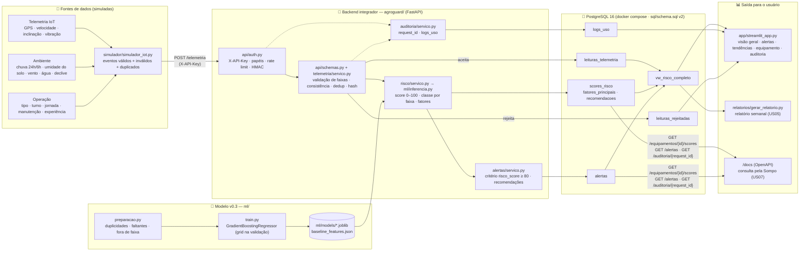
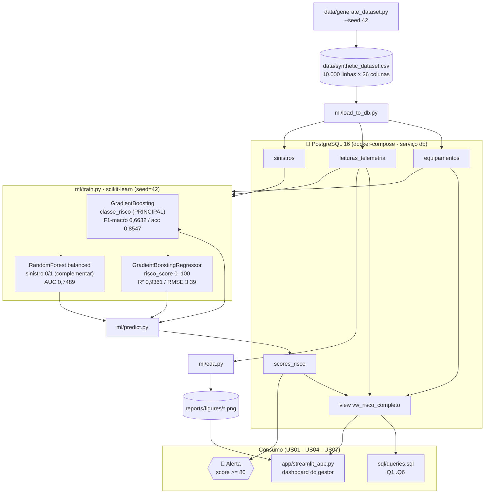
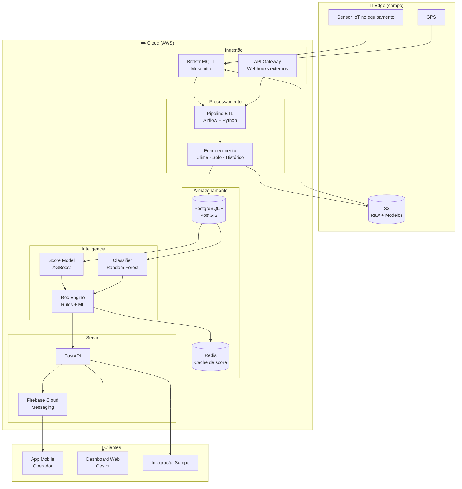
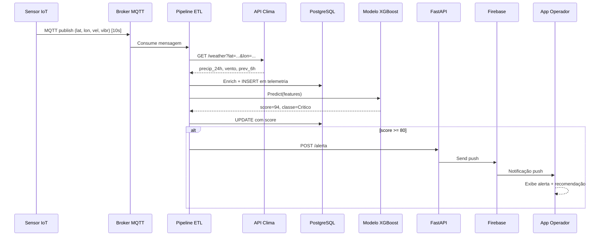
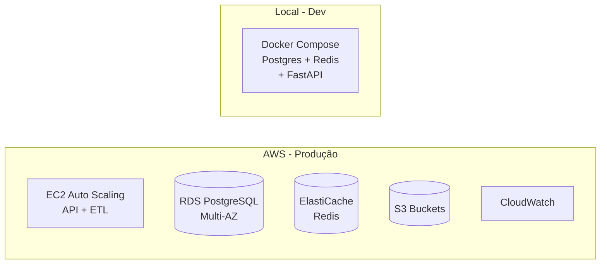

# 🏗️ Arquitetura Técnica — AgroGuard IA

> Documento de arquitetura aprofundada da solução. Complementa a visão geral apresentada no README.

---

## Arquitetura Consolidada — Sprints 3 e 4 (MVP integrado e validado)

> 🎯 Esta seção descreve o que **está implementado e rodando** ao final do Challenge. A Sprint 3 integrou os módulos em um fluxo contínuo (**entrada → banco → modelo → saída**) por meio de um backend Python; a Sprint 4 consolidou o MVP: código modular com tratamento de exceções, pipeline de preparação de dados, modelo v0.3, testes de integração, rastreabilidade e relatórios de tendência. A seção "Sprint 2" abaixo é mantida como histórico.

### Fluxo de ponta a ponta

### Como uma leitura atravessa o sistema (uma transação)

1. **Entrada** — o simulador (ou um dispositivo) envia `POST /telemetria` com o payload aninhado `{equipamento, telemetria, ambiente, operacao}` e o header `X-API-Key` (opcionalmente `X-Signature`, HMAC-SHA256 do corpo).
2. **Segurança** — `api/auth.py` hasheia a chave, compara em tempo constante, resolve o papel (`dispositivo`, `operador`, `gestor`, `seguradora`, `admin`), aplica o rate limit por chave e valida a assinatura.
3. **Validação** — `api/schemas.py` valida tipos e faixas (espelham os `CHECK` do banco); `telemetria/servico.py` aplica regras cruzadas (ex.: `parado` ⇒ velocidade < 1), calcula o `payload_hash` (SHA-256 do JSON canônico) e rejeita duplicidades por `(equip_id, data_hora)`. Toda rejeição vira uma linha em `leituras_rejeitadas` com o código do motivo.
4. **Persistência** — a leitura entra em `leituras_telemetria` com `origem`, `recebido_em`, `payload_bruto` e `request_id`.
5. **Modelo** — `risco/servico.py` monta as 16 features e chama `ml.inferencia.prever`: score (regressor v0.3), classe pelas faixas de negócio (`≤30 Baixo · ≤60 Médio · ≤80 Alto · >80 Crítico`), fatores principais (delta vs. baseline) e recomendações (tabela de regras explícitas). Grava em `scores_risco`.
6. **Alerta** — `alertas/servico.py` aplica o critério literal `risco_score >= 80`, grava em `alertas` (nível, critério, mensagem, recomendações) e devolve tudo na resposta `201`.
7. **Auditoria** — o middleware grava uma linha em `logs_uso` por requisição (inclusive 401/403/422) com o mesmo `request_id`, que também vai no header `X-Request-Id` e nas tabelas acima; `GET /auditoria/{request_id}` encadeia log → leitura → score → alerta.
8. **Saída** — o dashboard e o relatório leem `vw_risco_completo`, `alertas`, `logs_uso` e `leituras_rejeitadas`; a Sompo consulta o histórico via API.

Se qualquer etapa entre 4 e 6 falhar, a transação é desfeita e a leitura **não** fica pela metade no banco.

### Componente → Tecnologia → Arquivo (Sprints 3/4)

| Etapa | Tecnologia | Arquivo real |
|---|---|---|
| Fontes de dados (telemetria, ambiente, operação) | Python (amostragem do dataset + jitter), Open-Meteo opcional | `simulador/fontes/*.py`, `simulador/clima.py`, `simulador/simulador_iot.py` |
| API / orquestração do fluxo | FastAPI + Pydantic v2 | `agroguard/api/main.py`, `rotas_*.py`, `schemas.py` |
| Controle de acesso e proteção da API | X-API-Key + papéis, `hmac.compare_digest`, token bucket, HMAC opcional | `agroguard/api/auth.py`, `agroguard/config.py` |
| Regras de negócio | serviços por contexto (telemetria, risco, alertas, relatórios, auditoria) | `agroguard/<contexto>/servico.py` |
| Tratamento de exceções | hierarquia `ErroAgroGuard` → HTTP 401/403/409/422/429/503, sem stack trace | `agroguard/erros.py`, handlers em `api/main.py` |
| Persistência | PostgreSQL 16 (docker compose), DDL idempotente | `sql/schema.sql`, `agroguard/db.py`, `ml/db.py` |
| Preparação de dados | pandas — duplicidades, faltantes, fora de faixa | `ml/preparacao.py` → `reports/data_quality.json` |
| Modelo v0.3 | scikit-learn `GradientBoostingRegressor` (grid na validação) + classe por faixas | `ml/train.py`, `ml/inferencia.py`, `ml/explicabilidade.py` |
| Scoring em lote (idempotente) | Python | `ml/predict.py` |
| Consultas analíticas | SQL Q1..Q9 | `sql/queries.sql`, `ml/run_queries.py` |
| Interface | Streamlit (5 abas) | `app/streamlit_app.py`, `app/consultas.py` |
| Relatórios | Markdown + matplotlib | `relatorios/gerar_relatorio.py` → `reports/relatorio_risco.md` |
| Validação | pytest (unitários + integração contra o banco local `agroguard_test`) | `tests/` |
| Registros de uso / rastreabilidade | tabela `logs_uso` + `logs/agroguard.log` (JSON lines) | `agroguard/logs.py`, `agroguard/auditoria/servico.py` |

### Decisões técnicas das Sprints 3/4 (ADRs)

- **ADR-006 — HTTP/REST em vez de MQTT no protótipo.** O broker MQTT continua na arquitetura-alvo; no MVP a ingestão é `POST /telemetria`, o que permite validar, autenticar e auditar cada leitura com as disciplinas do primeiro ano e sem infraestrutura extra. Trade-off: sem QoS/offline; mitigado pelo simulador que reenvia e pela idempotência (dedup por `equip_id` + `data_hora`).
- **ADR-007 — Chave de API por papel, sem JWT/OAuth.** Cinco papéis com permissões por rota, segredos fora do git, comparação em tempo constante, rate limit e assinatura HMAC opcional. Suficiente para o MVP e auditável; JWT/MFA ficam para a produção (ver `docs/seguranca.md`).
- **ADR-008 — Classe derivada do score, não de um classificador separado.** A classe é uma política de negócio sobre o score (as mesmas faixas usadas no dataset); derivá-la do regressor ajustado elimina a inconsistência entre score e classe e elevou o recall de `Crítico` de 0,17 para 0,67 (`reports/metrics.json`). O classificador direto é mantido como baseline comparativo.
- **ADR-009 — Explicabilidade por contrafactual simples (delta vs. baseline).** Sem SHAP: para cada feature, o score é recalculado com a feature na mediana de treino; a diferença em pontos é a contribuição. Barato, determinístico e legível pelo operador.
- **ADR-010 — Uma transação por leitura e rejeições em transação própria.** Leitura, score e alerta nascem juntos ou não nascem; a rejeição é gravada fora da transação principal para sobreviver ao rollback e manter a trilha de auditoria completa.

---

## Arquitetura Consolidada — Sprint 2 (implementação atual)

> 🎯 Esta seção documenta o que **de fato foi implementado e está rodando** na Sprint 2 (entrega 2 de 4 do Challenge Sompo Seguros × FIAP). As seções 1 a 8 descrevem a **arquitetura-alvo** (visão de produto na nuvem); aqui descrevemos o **protótipo executável** local que valida essa visão.
>
> O foco da Sprint 2 são as User Stories **US01** (operador recebe alertas), **US04** (gestor vê mapa/ranking de risco) e **US07** (Sompo consulta score histórico).

### Pipeline real implementado

> ▶️ O pipeline completo é orquestrado por `run_pipeline.sh` (gera dataset → sobe banco → treina → prediz → carrega scores → roda queries), e a execução registrada está em `docs/prints/execucao_pipeline.txt`.

### Componente → Tecnologia → Arquivo

| Etapa do pipeline | Tecnologia | Arquivo real |
|---|---|---|
| Geração de dados sintéticos | Python (NumPy / pandas), `--seed 42` | `data/generate_dataset.py` → `data/synthetic_dataset.csv` |
| Schema do banco (DDL) | SQL · PostgreSQL 16 | `sql/schema.sql` |
| Carga do CSV no banco | Python + psycopg | `ml/load_to_db.py` |
| Banco de dados | PostgreSQL 16 (docker-compose, serviço `db`) | `docker-compose.yml`, `.env.example` |
| Acesso ao banco | Camada de conexão Python | `ml/db.py` |
| Engenharia de features | ColumnTransformer (OneHot nas categóricas, numéricas passthrough) | `ml/features.py` |
| Treino dos 3 modelos | scikit-learn (GradientBoosting classe + score, RandomForest sinistro) | `ml/train.py` → `ml/models/clf_classe.joblib`, `reg_score.joblib`, `clf_sinistro.joblib` |
| Inferência e persistência de scores | Python + joblib | `ml/predict.py` → tabela `scores_risco` |
| Consultas analíticas / validação de negócio | SQL (Q1..Q6) | `sql/queries.sql`, executadas por `ml/run_queries.py` |
| Análise exploratória e figuras | matplotlib / seaborn | `ml/eda.py` → `reports/figures/*.png` |
| Dashboard do gestor | Streamlit | `app/streamlit_app.py` |
| Orquestração ponta a ponta | Bash | `run_pipeline.sh` |
| Dependências | pip | `requirements.txt` |

**Features do modelo (X):** 13 numéricas + 3 categóricas (`tipo_equip`, `tipo_operacao`, `turno`). Os alvos e seus derivados (`risco_score`, `classe_risco`, `sinistro`, `tipo_sinistro`, `severidade_sinistro`) **não** entram em X (anti-vazamento), e `latitude`/`longitude` ficam **fora do modelo** — mantidas apenas para o mapa. O split é estratificado 70/15/15 por `classe_risco` (treino=7000, validação=1500, teste=1500).

### Como o protótipo Sprint 2 se relaciona com a arquitetura-alvo (AWS/MQTT)

O protótipo é um **espelho local e simplificado** da arquitetura de produção descrita nas seções seguintes. Cada peça da Sprint 2 corresponde a um componente da nuvem:

| Protótipo Sprint 2 (local) | Arquitetura-alvo (seções 1–8) | Equivalência |
|---|---|---|
| PostgreSQL 16 via `docker-compose` (serviço `db`) | PostgreSQL + PostGIS no RDS (Multi-AZ) | **Mesmo banco**; em produção ganha a extensão PostGIS para consultas geoespaciais e alta disponibilidade |
| `data/synthetic_dataset.csv` carregado por `ml/load_to_db.py` | Telemetria IoT via broker MQTT (Mosquitto) → ETL | O **CSV simula a telemetria IoT**; cada linha equivale a uma leitura de sensor que, em produção, chega por MQTT |
| `app/streamlit_app.py` (Streamlit) | Dashboard Web do gestor (React + Vite + Mapbox) | **Mesmo papel de produto** — o dashboard Streamlit é o protótipo do dashboard web do gestor (US04) |
| `ml/train.py` + `ml/predict.py` (scikit-learn) | Camada de IA (modelos versionados via MLflow, servidos por FastAPI) | Mesmos modelos baseados em árvores; em produção entram versionamento e serving |
| Alerta por `score >= 80` consultando `scores_risco` | Push via FastAPI + Firebase Cloud Messaging | Mesma **regra de negócio de alerta** (limiar 80); o canal de entrega evolui para push (US01) |

> Em resumo: o **banco local Postgres é o Postgres/PostGIS da nuvem**, o **CSV simula a telemetria IoT** e o **dashboard Streamlit é o dashboard web do gestor**. A Sprint 2 prova a cadeia *dados → features → modelo → score → alerta/dashboard* de ponta a ponta, sem depender ainda da infraestrutura AWS.

---

## 1. Visão de alto nível

O AgroGuard IA segue uma arquitetura em camadas bem definidas, com separação clara entre **coleta**, **processamento**, **inteligência** e **interface**. Essa separação permite:

- Substituir componentes individualmente (ex.: trocar broker MQTT por Kafka) sem afetar o restante.
- Escalar verticalmente cada camada conforme a demanda.
- Auditar o fluxo de dados ponta a ponta — requisito da Sompo.

---

## 2. Decisões de arquitetura (ADRs resumidos)

### ADR-001: Por que MQTT em vez de HTTP para coleta IoT?
- **Decisão:** MQTT (Mosquitto)
- **Motivos:** baixo overhead, suporta conexões instáveis (comum em zona rural), QoS configurável, padrão de mercado IoT.
- **Trade-off:** exige broker; mais complexo de operar que REST.

### ADR-002: Por que PostgreSQL com PostGIS?
- **Decisão:** PostgreSQL + extensão PostGIS
- **Motivos:** consultas geoespaciais nativas (distância a corpos d'água, polígonos de fazendas), open source, maduro.
- **Trade-off:** menos performático que data warehouses para analytics massiva — para Sprint 4+ podemos adicionar BigQuery/Athena.

### ADR-003: Por que XGBoost + Random Forest e não Deep Learning?
- **Decisão:** modelos baseados em árvores
- **Motivos:** dados tabulares, alta interpretabilidade (importante para a seguradora), bom desempenho mesmo com dataset pequeno, treinamento rápido.
- **Trade-off:** pode perder ganho marginal vs. modelos mais complexos. Aceitável no estágio atual.

### ADR-004: Por que FastAPI?
- **Decisão:** FastAPI
- **Motivos:** validação automática via Pydantic, docs OpenAPI gerados, async nativo, performance comparável a Node.js.
- **Trade-off:** ecossistema Python — ok pois mantém stack unificada com modelos.

### ADR-005: Mobile nativo ou React Native?
- **Decisão:** React Native (com possibilidade de evoluir pra Flutter na Sprint 3+)
- **Motivos:** time enxuto, code sharing com web, push via Firebase OOB.
- **Trade-off:** menor performance em apps que exigem hardware intensivo — não é nosso caso.

---

## 3. Fluxo detalhado: do sensor ao alerta

---

## 4. Componentes — detalhamento técnico

### 4.1 Camada de coleta (Edge)

**Hardware previsto (cenário ideal):**
- Microcontrolador ESP32 ou similar
- Módulo GPS (NEO-6M)
- Acelerômetro/giroscópio (MPU-6050)
- Conectividade: 4G/LoRaWAN

**Frequência de envio:**
- Posição GPS: a cada 10 s
- Vibração/inclinação: a cada 5 s (média móvel)
- Heartbeat: a cada 60 s

**Para protótipo (Sprint 3):** simulador em Python que replica o comportamento usando o `synthetic_dataset.csv`.

### 4.2 Camada de ingestão

- **Broker:** Mosquitto rodando em container Docker
- **Tópicos MQTT:**
  - `agroguard/{equip_id}/telemetry`
  - `agroguard/{equip_id}/heartbeat`
  - `agroguard/{equip_id}/event`
- **Autenticação:** mTLS por equipamento + tokens HMAC nas mensagens
- **API Gateway:** AWS API Gateway para webhooks externos (Sompo, parceiros)

### 4.3 Pipeline ETL

- **Orquestração:** Apache Airflow (DAGs por hora)
- **Transformações principais:**
  1. Validação de schema (Pydantic)
  2. Enriquecimento com clima (cache de 30 min)
  3. Enriquecimento com solo/topografia (cache permanente por região)
  4. Cálculo de features derivadas (jornada acumulada, dias desde manutenção)
  5. Inferência de modelo (latência alvo < 200 ms)
  6. Persistência

### 4.4 Armazenamento

| Dado | Tecnologia | Retenção |
|---|---|---|
| Telemetria bruta | S3 (Parquet) | 5 anos |
| Telemetria enriquecida | PostgreSQL | 12 meses |
| Score histórico | PostgreSQL | 5 anos |
| Modelos versionados | S3 + MLflow | indefinido |
| Cache de predições | Redis | 5 min |
| Logs de auditoria | CloudWatch | 12 meses |

### 4.5 Camada de IA

**Pipeline de treino:**
1. Dataset (synthetic na Sprint 2, real na Sprint 4+)
2. Split estratificado (70/15/15)
3. Treinamento XGBoost + Random Forest
4. Avaliação (AUC, F1 macro, confusion matrix)
5. Versionamento via MLflow
6. Deploy via API com health-check

**Pipeline de inferência:**
- Latência alvo: P99 < 250 ms
- Throughput esperado: 100 req/s na Sprint 4 (pico em horário de operação)
- Estratégia de retreino: semanal, com gate manual para promover ao prod

### 4.6 Servir e notificar

- **API:** FastAPI com OpenAPI docs públicas
- **Auth:** JWT (operador/gestor) + API Key (Sompo)
- **Rate limit:** 1.000 req/min por cliente
- **Push:** Firebase Cloud Messaging (Android primeiro, iOS na Sprint 4)

### 4.7 Frontend

**App mobile (operador):**
- React Native + Expo
- Telas: Home (status), Mapa, Histórico, Registro de ocorrência
- Funciona offline (fila local de eventos sincronizada quando volta sinal)

**Dashboard web (gestor):**
- React + Vite + TypeScript
- Mapbox para visualização geoespacial
- Recharts para KPIs
- Export PDF de relatórios via API server-side

---

## 5. Infraestrutura

### 5.1 Ambiente alvo

### 5.2 CI/CD

- **Repo:** GitHub privado
- **Pipeline:** GitHub Actions
- **Etapas:** lint → testes → build container → deploy em staging → smoke tests → promote para prod (manual)
- **Versionamento de modelos:** MLflow + tags semânticas

### 5.3 Observabilidade

- **Logs:** CloudWatch (estruturados em JSON)
- **Métricas:** Prometheus + Grafana
- **Trace distribuído:** OpenTelemetry
- **Alertas operacionais:** PagerDuty/Slack para SREs

---

## 6. Segurança em profundidade

| Camada | Controle |
|---|---|
| Edge | mTLS, HMAC, certificado por dispositivo |
| Rede | VPC privada, security groups restritivos, WAF na API |
| App | OWASP Top 10 mitigado, dependências escaneadas (Snyk) |
| Dados | Criptografia AES-256 em repouso, TLS 1.3 em trânsito |
| Identidade | JWT curto + refresh, MFA para gestores e Sompo |
| Auditoria | Trilha imutável (CloudTrail + S3 Object Lock) |
| LGPD | DPIA realizado, consentimento granular, anonimização em datasets de treino |

---

## 7. Limitações conhecidas e mitigações

| Limitação | Mitigação planejada |
|---|---|
| Conectividade rural intermitente | Buffer local no edge + sync diferido |
| Dados climáticos com baixa granularidade | Combinar múltiplas fontes (INMET + estação local quando disponível) |
| Cold start para equipamentos novos | Score baseado em "perfil semelhante" enquanto não há histórico |
| Drift do modelo | Monitoramento contínuo + retreino agendado |
| Resistência cultural ao app | Onboarding com cooperativa + treinamento prático |

---

## 8. Roadmap de evolução da arquitetura

| Sprint | Evolução | Status |
|---|---|---|
| 1 | Arquitetura proposta (este doc) | ✅ Concluída |
| 2 | PoC local com Docker Compose, modelo treinado em dataset simulado | ✅ Concluída (ver seção "Arquitetura Consolidada — Sprint 2") |
| 3 | Backend integrador (FastAPI), simulador de fontes, segurança e auditoria | ✅ Concluída (ver seção "Sprints 3 e 4") |
| 4 | Refinamento (módulos, exceções, preparação de dados, modelo v0.3), testes de integração, tendências e relatórios | ✅ Concluída (ver seção "Sprints 3 e 4") |
| Pós-Challenge | Edge real, retreino automático, integração com core Sompo | 🔭 Futuro |
