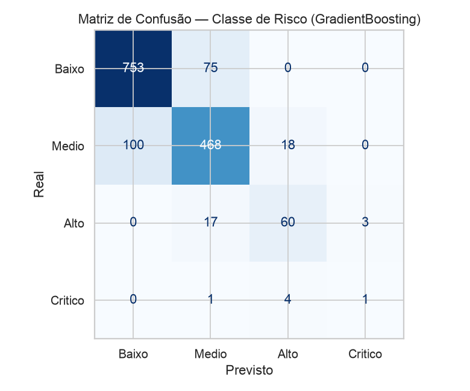
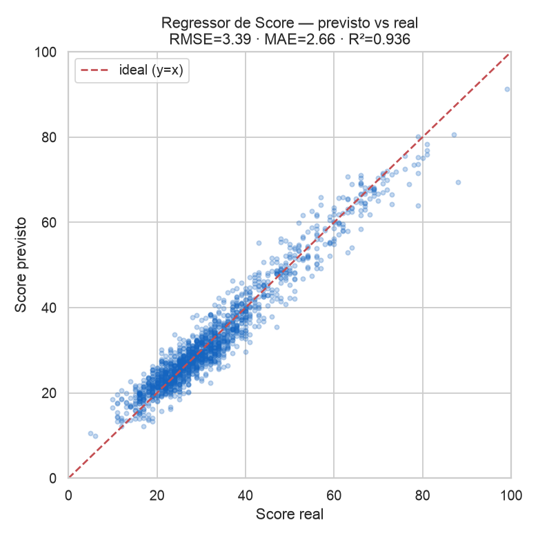
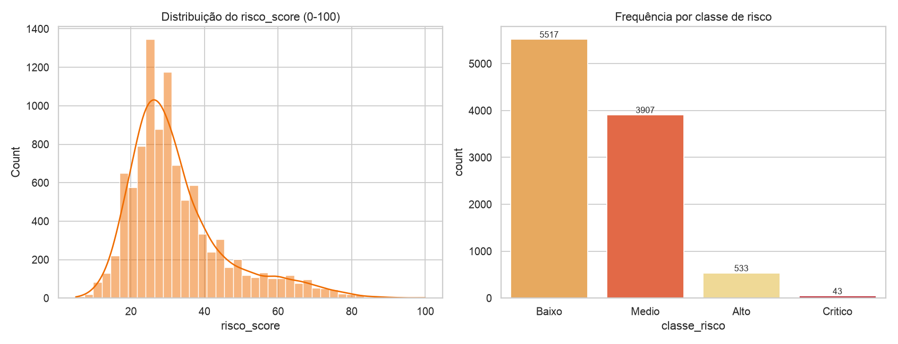
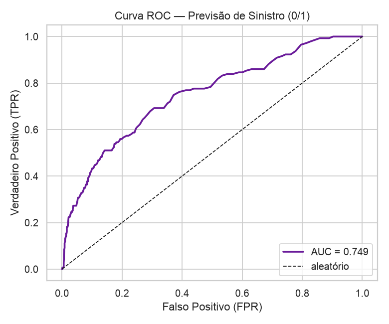
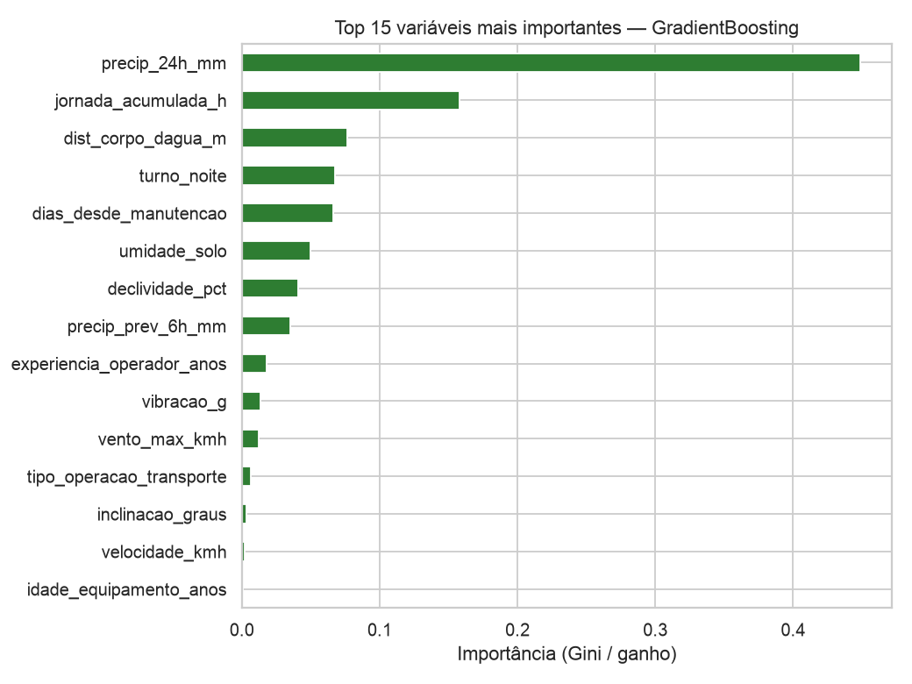
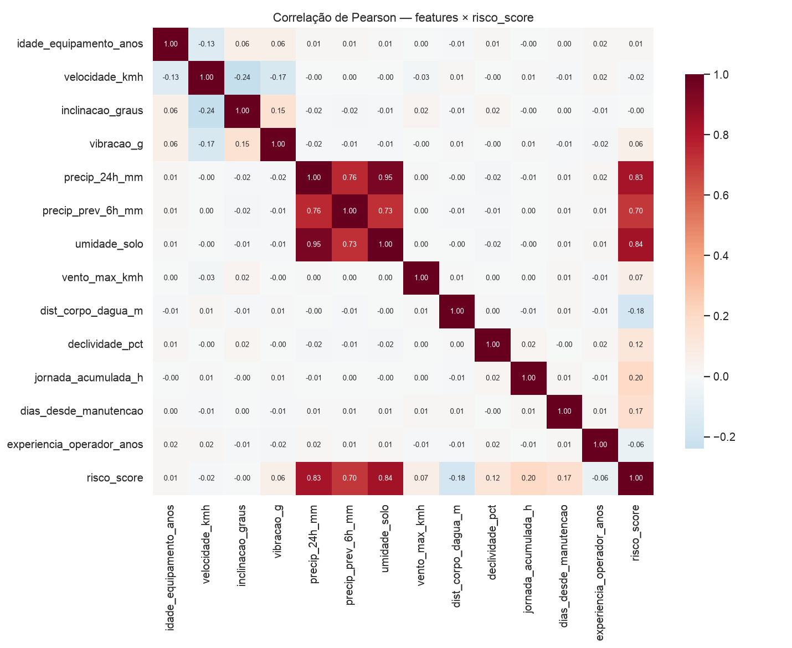
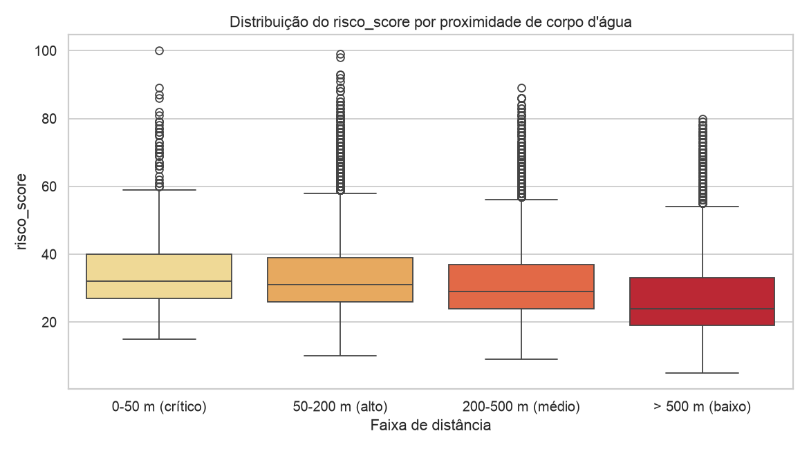
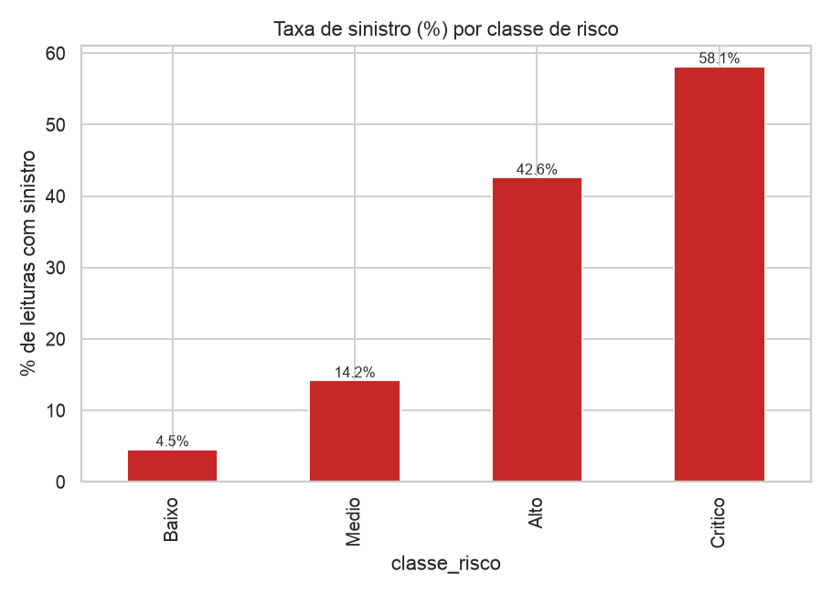

# 🤖 Inteligência Preditiva — AgroGuard IA

> Documentação de ponta a ponta da camada de Machine Learning do **AgroGuard IA** (Challenge Sompo Seguros × FIAP — entrega da **Sprint 2 de 4**).
> Versão dos modelos: **v0.2** · Reprodutível com `seed=42` · Fonte das métricas: [`reports/metrics.json`](../reports/metrics.json).
>
> User Stories cobertas: **US01** (operador recebe alertas), **US04** (gestor vê mapa/ranking de risco), **US07** (Sompo consulta score histórico).

---

## 1. Visão geral da abordagem

O AgroGuard IA não é um único modelo: é uma **combinação de três modelos complementares** treinados sobre os mesmos dados de telemetria agrícola, cada um respondendo a uma pergunta de negócio diferente.

| # | Modelo | Algoritmo | Alvo | Pergunta de negócio | Métrica principal (teste) |
|---|---|---|---|---|---|
| 1️⃣ | **Classificador de classe** (PRINCIPAL) | `GradientBoostingClassifier` | `classe_risco` (Baixo/Medio/Alto/Critico) | "Em qual faixa de risco esta operação está?" | F1-macro = **0,6632** · acc = **0,8547** |
| 2️⃣ | **Regressor de score** | `GradientBoostingRegressor` | `risco_score` (0–100) | "Qual o risco numérico exato, para ranking e alerta?" | R² = **0,9361** · RMSE = **3,39** · MAE = **2,66** |
| 3️⃣ | **Classificador de sinistro** (COMPLEMENTAR) | `RandomForestClassifier` *balanced* | `sinistro` (0/1) | "Qual a probabilidade de ocorrer um sinistro real?" | AUC = **0,7489** · F1 = **0,3099** · recall = **0,2308** |

### Por que essa combinação?

- 🎯 **Classe** é o que o gestor e o operador entendem rápido (rótulo legível, código de cor no dashboard) → atende **US01** e **US04**.
- 📈 **Score contínuo (0–100)** dá granularidade para **ranking** entre equipamentos e para o **gatilho de alerta** (limiar = 80). Como tem R² = 0,9361, é a saída mais estável e por isso é a base do alerta — não a classe rara.
- ⚠️ **Sinistro (0/1)** é o alvo mais "honesto" do ponto de vista de ML: é **estocástico** (não é função determinística das features), com AUC = 0,7489. Serve à **US07** (visão de probabilidade de perda para precificação da Sompo) e prova que o pipeline funciona num problema de risco real, não só na função latente do gerador.

As três saídas são persistidas no PostgreSQL (tabela `scores_risco`) e expostas pela view `vw_risco_completo`, consumida pelo dashboard Streamlit.

---

## 2. Entradas do modelo (features X)

O modelo recebe **16 features**: **13 numéricas + 3 categóricas**. As coordenadas e todos os alvos/derivados ficam **fora** de `X`.

### 2.1 Features numéricas (13)

| Feature | Descrição | Correlação Pearson com `risco_score` |
|---|---|---|
| `umidade_solo` | Umidade do solo | **+0,837** |
| `precip_24h_mm` | Precipitação acumulada nas últimas 24 h | **+0,828** |
| `precip_prev_6h_mm` | Precipitação prevista para as próximas 6 h | **+0,703** |
| `jornada_acumulada_h` | Horas acumuladas de jornada do equipamento | +0,200 |
| `dias_desde_manutencao` | Dias desde a última manutenção | +0,169 |
| `declividade_pct` | Declividade do terreno (%) | +0,121 |
| `vento_max_kmh` | Velocidade máxima do vento | +0,070 |
| `vibracao_g` | Vibração medida (g) | +0,059 |
| `idade_equipamento_anos` | Idade do equipamento | +0,013 |
| `inclinacao_graus` | Inclinação | −0,003 |
| `velocidade_kmh` | Velocidade de deslocamento | −0,015 |
| `experiencia_operador_anos` | Experiência do operador | −0,064 |
| `dist_corpo_dagua_m` | Distância a corpo d'água | **−0,178** |

### 2.2 Features categóricas (3)

| Feature | Descrição | Tratamento |
|---|---|---|
| `tipo_equip` | Tipo de equipamento | One-Hot Encoding |
| `tipo_operacao` | Tipo de operação | One-Hot Encoding |
| `turno` | Turno (manhã/tarde/noite) | One-Hot Encoding |

### 2.3 Decisão anti-vazamento (data leakage) 🚫

Para evitar que o modelo "veja a resposta" e produza métricas infladas, **ficam fora de `X`**:

- **Os alvos e seus derivados**: `risco_score`, `classe_risco`, `sinistro`, `tipo_sinistro`, `severidade_sinistro`. Incluí-los faria o modelo prever a partir de variáveis que só existem *depois* de o evento ocorrer.
- **`latitude` e `longitude`**: ficam fora do modelo porque codificariam memorização geográfica do conjunto sintético (overfitting a coordenadas específicas). São mantidas no banco **apenas para o mapa** da US04, nunca como feature preditiva.

Assim, o modelo prediz risco a partir de **condições operacionais e ambientais brutas**, que é exatamente o que estará disponível em produção *antes* de um sinistro acontecer.

---

## 3. Pré-processamento e split

### 3.1 Pré-processamento — `ColumnTransformer`

- **Categóricas** (`tipo_equip`, `tipo_operacao`, `turno`) → **One-Hot Encoding**.
- **Numéricas** (as 13 acima) → **passthrough** (sem escala — ver §4 por que árvores dispensam normalização).

Encapsular tudo num `ColumnTransformer` garante que o mesmo pré-processamento aprendido no treino seja aplicado idêntico na validação, no teste e em inferência (`ml/predict.py`), sem vazamento entre splits.

### 3.2 Split estratificado 70/15/15

| Conjunto | Linhas | Proporção |
|---|---|---|
| Treino | **7000** | 70% |
| Validação | **1500** | 15% |
| Teste | **1500** | 15% |
| **Total** | **10 000** | 100% |

- Split **estratificado por `classe_risco`**, preservando a proporção das classes em cada conjunto — essencial porque o dataset é fortemente desbalanceado.
- **`seed=42`** em geração, split e treino → todo o pipeline é **reprodutível**.

### 3.3 Dataset

`data/synthetic_dataset.csv` — **10 000 linhas × 26 colunas**, gerado por `data/generate_dataset.py --seed 42`.

| `classe_risco` | Quantidade |
|---|---|
| Baixo | 5517 |
| Medio | 3907 |
| Alto | 533 |
| Critico | 43 |

**Taxa de sinistro global = 10,57%.**

---

## 4. Justificativa técnica dos algoritmos

### 4.1 Por que árvores / ensembles (Gradient Boosting e Random Forest)

- 🌳 **Boas com dados tabulares mistos**: lidam nativamente com numéricas + categóricas (após One-Hot), que é a natureza dos dados de telemetria.
- ⚖️ **Não exigem escala/normalização**: por isso as numéricas entram como *passthrough*; divisões por limiar são invariantes a escala.
- 🔍 **Interpretáveis**: fornecem **importância de features** diretamente, o que é decisivo para confiança do operador e auditoria da Sompo (US07).
- 🧩 **Robustas a relações não lineares e interações** entre variáveis (ex.: chuva alta *combinada* com proximidade a corpo d'água).
- 🛡️ **Random Forest *balanced*** para o sinistro: o `class_weight=balanced` compensa o desbalanceamento (apenas 10,57% de positivos).

A escolha do **GradientBoosting** como classificador principal foi feita por **comparação empírica na validação**:

| Modelo | F1-macro (val.) | Accuracy (val.) |
|---|---|---|
| RandomForest | 0,6258 | 0,8687 |
| **GradientBoosting ✅** | **0,6765** | **0,8707** |

GradientBoosting venceu em ambas as métricas e foi promovido ao teste.

### 4.2 Por que NÃO deep learning ❌

- 📊 **Volume de dados modesto** (10 000 linhas): redes profundas precisam de muito mais dados para superar ensembles em tabular; aqui tenderiam a *overfitar*.
- 🧠 **Tabular estruturado**: a literatura mostra que *gradient boosting* costuma igualar ou superar redes neurais em problemas tabulares deste porte.
- 🔎 **Explicabilidade > caixa-preta** para um produto de seguros: precisamos justificar *por que* um equipamento foi marcado como risco.
- ⚙️ **Custo operacional**: ensembles do scikit-learn treinam em segundos, sem GPU, e rodam dentro do `docker-compose` do projeto. Não usamos `xgboost` — apenas **scikit-learn**.

---

## 5. Interpretação dos resultados

### 5.1 O que cada saída significa

- **`risco_score` (0–100)**: índice contínuo de risco operacional. Quanto maior, mais perigosa a condição atual. É a saída de maior qualidade (R² = 0,9361, RMSE = 3,39).
- **`classe_risco`**: faixa legível derivada do contexto (Baixo → Crítico) para leitura rápida.
- **`prob_sinistro`**: probabilidade estimada de ocorrência de sinistro real (saída do modelo complementar).

### 5.2 Como o alerta (≥ 80) é gerado 🚨

> **Limiar de alerta = 80.** Quando `risco_score ≥ 80`, dispara-se um **alerta** ao operador (US01).

A decisão crítica de design é que **o alerta é baseado no SCORE, não na classe rara "Critico"**. Motivo: o regressor é muito mais confiável (R² = 0,94) do que a classificação da classe Crítico, que é rara e tem recall baixo. Nos dados persistidos, isso resulta em **26 alertas** (`score ≥ 80`).

### 5.3 Resultados do classificador principal (teste)

- accuracy = **0,8547** · F1-macro = **0,6632** · CV 5-fold F1-macro = **0,5813 ± 0,0081**

| Classe | Precision | Recall | F1 | Suporte |
|---|---|---|---|---|
| Baixo | 0,88 | 0,91 | 0,90 | 828 |
| Medio | 0,83 | 0,80 | 0,82 | 586 |
| Alto | 0,73 | 0,75 | 0,74 | 80 |
| Critico | 0,25 | 0,17 | 0,20 | 6 |

**Matriz de confusão** (linhas = REAL, colunas = PREVISTO; ordem `[Baixo, Medio, Alto, Critico]`):

| REAL ↓ \ PREVISTO → | Baixo | Medio | Alto | Critico |
|---|---|---|---|---|
| **Baixo** | 753 | 75 | 0 | 0 |
| **Medio** | 100 | 468 | 18 | 0 |
| **Alto** | 0 | 17 | 60 | 3 |
| **Critico** | 0 | 1 | 4 | 1 |

O modelo é forte nas classes frequentes (Baixo/Medio) e razoável em Alto (F1 = 0,74). A fraqueza está em Critico — tratada na §7.

### 5.4 Regressor de score

RMSE = **3,39** · MAE = **2,66** · R² = **0,9361** — o score previsto acompanha de perto o real.

### 5.5 Classificador de sinistro

AUC = **0,7489** · F1 = **0,3099** · recall = **0,2308**. Por ser um alvo **estocástico**, é o problema de ML mais realista do projeto.

### 5.6 Importância de features e correlações

**Top features do classificador GradientBoosting:**

| Feature | Importância |
|---|---|
| `precip_24h_mm` | 0,449 |
| `jornada_acumulada_h` | 0,158 |
| `dist_corpo_dagua_m` | 0,076 |
| `turno_noite` | 0,068 |
| `dias_desde_manutencao` | 0,066 |
| `umidade_solo` | 0,050 |
| `declividade_pct` | 0,041 |
| `precip_prev_6h_mm` | 0,035 |

Correlação com **ocorrência de sinistro (0/1)**: `umidade_solo` 0,291 · `precip_24h_mm` 0,289 · `precip_prev_6h_mm` 0,242 — chuva e umidade são os principais condutores de risco, coerente com o domínio agrícola.

### 5.7 Como cada saída serve cada persona

| Saída | 👷 Operador (US01) | 🧑‍💼 Gestor (US04) | 🏢 Sompo (US07) |
|---|---|---|---|
| `risco_score` | Alerta quando ≥ 80 | Ranking de equipamentos | Histórico de score por equipamento |
| `classe_risco` | Cor/rótulo no app | Mapa e ranking por faixa | Segmentação de carteira |
| `prob_sinistro` | — | Priorização de inspeção | Insumo de precificação |

### 5.8 Validação de negócio (banco — query Q3)

A taxa de sinistro **real** cresce monotonicamente conforme a classe **prevista** sobe — evidência de que o modelo de fato separa risco:

| Classe prevista | Leituras | Score médio | Taxa de sinistro real |
|---|---|---|---|
| Baixo | 5729 | 24,4 | **4,82%** |
| Medio | 3722 | 39,8 | **14,59%** |
| Alto | 510 | 67,2 | **41,96%** |
| Critico | 39 | 80,0 | **61,54%** |

**Variável crítica — risco por distância a corpo d'água (Q4):**

| Faixa de distância | Score médio | Taxa de sinistro |
|---|---|---|
| 0–50 m | 35,5 | 12,20% |
| 50–200 m | 34,7 | 11,61% |
| 200–500 m | 32,6 | 10,78% |
| > 500 m | 28,3 | 8,27% |

Quanto mais perto da água, maior o risco — confirmando a correlação negativa de `dist_corpo_dagua_m` (−0,178).

Distribuição da classe prevista persistida: Baixo = 5729 · Medio = 3722 · Alto = 510 · Critico = 39 · **Alertas (score ≥ 80) = 26**.

---

## 6. Rastreabilidade vs. Sprint 1 (model-card v0.1 → v0.2)

A Sprint 1 entregou **proposta e arquitetura**; a Sprint 2 entrega os **modelos treinados e medidos**. O que mudou:

| Aspecto | Sprint 1 — v0.1 (proposta) | Sprint 2 — v0.2 (implementado) |
|---|---|---|
| Status | Proposta / arquitetura | Modelos treinados, medidos e persistidos |
| Frameworks | scikit-learn **+ XGBoost** | **somente scikit-learn** (sem XGBoost) |
| Regressão de score | XGBoost (proposto) | `GradientBoostingRegressor` — R² = 0,9361 |
| Classificação de classe | Random Forest (proposto) | `GradientBoostingClassifier` (venceu o RF na validação) |
| Classificação de sinistro | — | `RandomForestClassifier` *balanced* — AUC = 0,7489 |
| Métricas | Sem dados reais | `reports/metrics.json` (`modelo_versao=v0.2`, `seed=42`) |
| Validação de negócio | — | Queries Q3/Q4 no PostgreSQL confirmam separação de risco |

A troca de XGBoost por GradientBoosting do scikit-learn foi deliberada: mantém o poder de *boosting* sem dependência externa adicional, simplificando o `docker-compose` e a reprodutibilidade. As demais decisões da v0.1 (combinação regressão + classificação) foram **mantidas e validadas**.

---

## 7. Limitações e uso responsável ⚠️

Reportamos os resultados **sem inflar**:

- 🔴 **Classe "Critico" é rara** (43/10 000 → apenas **6 no teste**), resultando em recall baixo (**0,17**). **Mitigações**: (a) o **alerta é baseado no SCORE** (regressor com R² = 0,94 / RMSE = 3,4), não na classe rara; (b) *threshold tuning*; (c) coleta de **mais dados reais na Sprint 4**.
- 🧪 **Função latente determinística**: no gerador sintético, `risco_score` e `classe_risco` são **função determinística** das features. Os modelos aprendem essa função a partir das variáveis brutas — válido academicamente, mas documentado como limitação. Já o alvo **`sinistro` é estocástico** (AUC = 0,75), representando um problema de ML mais realista.
- 🧬 **Dados 100% sintéticos**: a **validação cruzada com dados reais está prevista para a Sprint 4**.
- 🚧 **Fora de escopo**: o sistema **não** substitui o operador em decisões críticas de campo e **não** aprova/nega sinistros automaticamente. As saídas são **apoio à decisão**.

---

### 📂 Artefatos relacionados

- Código ML: `ml/db.py`, `ml/features.py`, `ml/train.py`, `ml/load_to_db.py`, `ml/predict.py`, `ml/run_queries.py`, `ml/eda.py`
- Dashboard: `app/streamlit_app.py` · Orquestração: `run_pipeline.sh`
- SQL: `sql/schema.sql` (DDL), `sql/queries.sql` (Q1..Q6)
- Métricas: [`reports/metrics.json`](../reports/metrics.json) · Figuras: [`reports/figures/`](../reports/figures/)
- Documentos correlatos: [`model-card.md`](./model-card.md), [`data-dictionary.md`](./data-dictionary.md), [`architecture.md`](./architecture.md), [`personas.md`](./personas.md)
