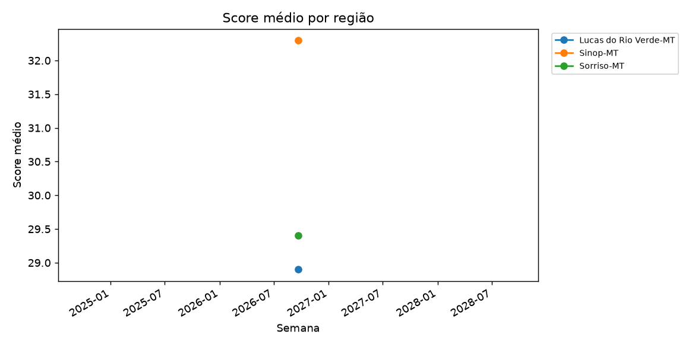
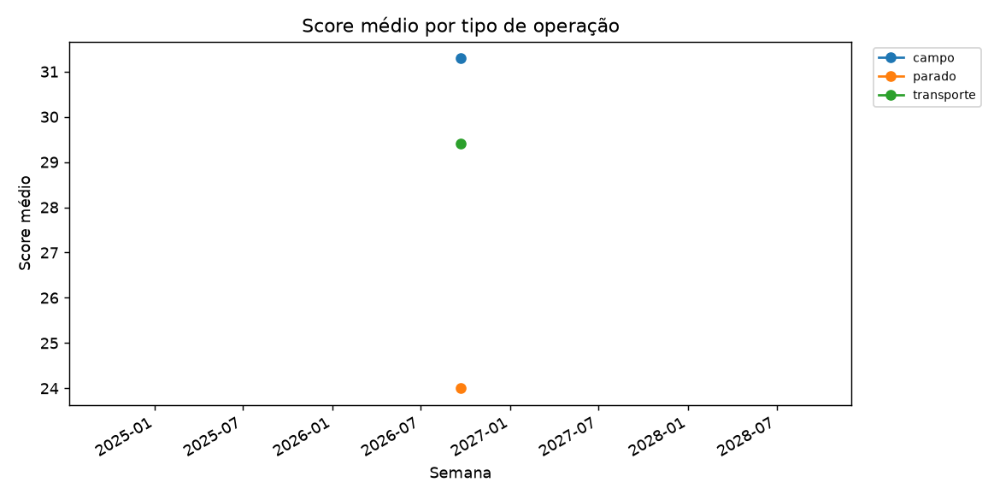
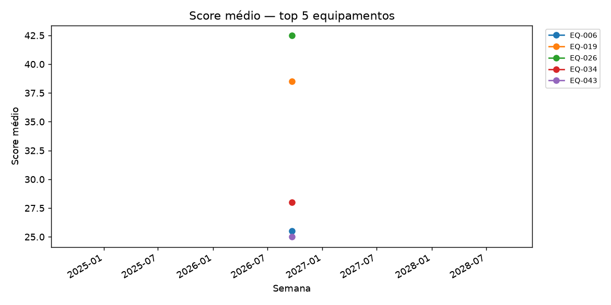

# Relatório semanal de risco — AgroGuard IA

## Período coberto

De **28/07/2026** a **22/09/2026**.

## Indicadores da semana (KPIs)

- Leituras no período: **92**
- Score médio: **30.2**
- Alertas ativos: **2**
- Taxa de sinistro: **0.00%**
- Equipamentos com leitura no período: **50**

## Top 5 equipamentos por score médio (US05)

| equip_id | tipo_equip | leituras | score_medio | score_pico | alertas_criticos | sinistros_reais |
| --- | --- | --- | --- | --- | --- | --- |
| EQ-043 | Pulverizador | 183 | 34.3 | 79 | 0 | 24 |
| EQ-006 | Colheitadeira | 213 | 34.0 | 89 | 1 | 22 |
| EQ-019 | Trator | 209 | 34.0 | 78 | 0 | 27 |
| EQ-034 | Caminhão | 192 | 33.7 | 74 | 0 | 18 |
| EQ-026 | Colheitadeira | 199 | 33.5 | 91 | 2 | 31 |

## Tendência semanal por região

| chave | periodo | leituras | score_medio | score_pico | alertas | taxa_sinistro_pct |
| --- | --- | --- | --- | --- | --- | --- |
| Lucas do Rio Verde-MT | 2026-09-21 00:00:00 | 31 | 28.9 | 69 | 0 | 0.00 |
| Sinop-MT | 2026-09-21 00:00:00 | 31 | 32.3 | 99 | 1 | 0.00 |
| Sorriso-MT | 2026-09-21 00:00:00 | 30 | 29.4 | 95 | 1 | 0.00 |

## Tendência semanal por tipo de operação

| chave | periodo | leituras | score_medio | score_pico | alertas | taxa_sinistro_pct |
| --- | --- | --- | --- | --- | --- | --- |
| campo | 2026-09-21 00:00:00 | 66 | 31.3 | 99 | 2 | 0.00 |
| parado | 2026-09-21 00:00:00 | 9 | 24.0 | 35 | 0 | 0.00 |
| transporte | 2026-09-21 00:00:00 | 17 | 29.4 | 69 | 0 | 0.00 |

## Tendência dos top 5 equipamentos

## Alertas abertos e recomendações

| equip_id | fazenda | regiao | data_hora | nivel | risco_score | criterio | recomendacoes | status |
| --- | --- | --- | --- | --- | --- | --- | --- | --- |
| EQ-021 | FAZ-04 | Sorriso-MT | 2026-09-21 22:10:00 | Critico | 95 | risco_score >= 80 | ADIAR_OPERACAO — umidade_solo > 0.7 e dist_corpo_dagua_m < 100 · REDUZIR_VELOCIDADE — declividade_pct > 5 ou inclinacao_graus > 6 · ATENCAO_CHUVA — precip_24h_mm > 30 ou precip_prev_6h_mm > 10 · INSPECAO_MECANICA — dias_desde_manutencao > 40 ou vibracao_g > 1.5 · PAUSA_JORNADA — jornada_acumulada_h > 10 | aberto |
| EQ-014 | FAZ-03 | Sinop-MT | 2026-09-21 23:30:00 | Critico | 99 | risco_score >= 80 | ADIAR_OPERACAO — umidade_solo > 0.7 e dist_corpo_dagua_m < 100 · REDUZIR_VELOCIDADE — declividade_pct > 5 ou inclinacao_graus > 6 · ATENCAO_CHUVA — precip_24h_mm > 30 ou precip_prev_6h_mm > 10 · INSPECAO_MECANICA — dias_desde_manutencao > 40 ou vibracao_g > 1.5 · PAUSA_JORNADA — jornada_acumulada_h > 10 | aberto |

## Recomendações da semana

- **REDUZIR_VELOCIDADE** (21x) — declividade_pct > 5 ou inclinacao_graus > 6
- **INSPECAO_MECANICA** (15x) — dias_desde_manutencao > 40 ou vibracao_g > 1.5
- **ATENCAO_CHUVA** (13x) — precip_24h_mm > 30 ou precip_prev_6h_mm > 10
- **PAUSA_JORNADA** (13x) — jornada_acumulada_h > 10
- **ADIAR_OPERACAO** (5x) — umidade_solo > 0.7 e dist_corpo_dagua_m < 100

